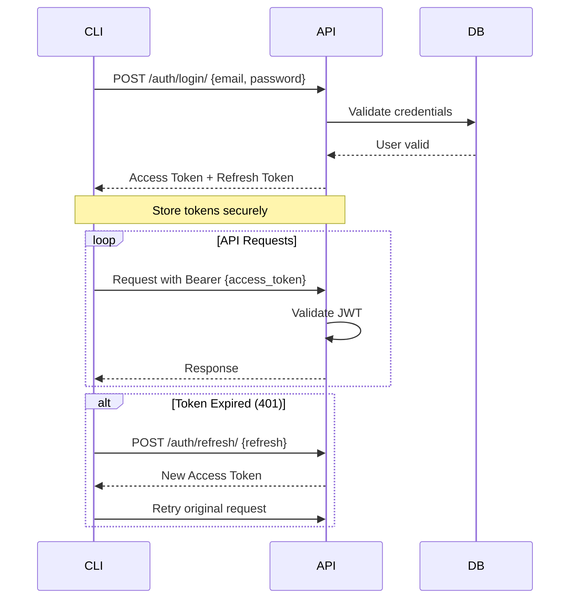

# LedgerSG API CLI Usage Guide

> **Direct Backend API Interaction via Command Line**
> **For AI Agents and Advanced Users**
> **Version**: 2.0.0
> **Last Updated**: 2026-03-02
> **Status**: Production Ready ✅ (SEC-001 & SEC-002 Remediated)

---

## ⚠️ Important Notice

**This guide is for direct API interaction via CLI, bypassing the frontend GUI.**

### When to Use This Guide
- ✅ AI agents automating tasks
- ✅ Testing API endpoints directly
- ✅ Bulk data operations
- ✅ CI/CD pipeline integration
- ✅ Debugging frontend-backend issues

### When NOT to Use This Guide
- ❌ Standard user workflows (use the web UI)
- ❌ Complex forms requiring validation
- ❌ Real-time collaborative editing
- ❌ Features requiring frontend state (caching, optimistic updates)

---

## Table of Contents

1. [Authentication](#authentication)
2. [Organization Context](#organization-context)
3. [Common API Patterns](#common-api-patterns)
4. [API Endpoints Reference](#api-endpoints-reference)
5. [CLI Examples](#cli-examples)
6. [Error Handling](#error-handling)
7. [Limitations & Gotchas](#limitations--gotchas)
8. [Advanced Usage](#advanced-usage)

---

## Authentication

### Overview

LedgerSG uses **JWT Authentication** with:
- **Access Token**: 15-minute expiration (stored in memory)
- **Refresh Token**: 7-day expiration (HttpOnly cookie)

### Authentication Flow



### Login

**Endpoint**: `POST /api/v1/auth/login/`

**Rate Limit**: 10 requests/minute per IP + 30 requests/minute per user

**Request:**
```bash
curl -X POST http://localhost:8000/api/v1/auth/login/ \
  -H "Content-Type: application/json" \
  -d '{
    "email": "user@example.com",
    "password": "secure_password"
  }'
```

**Response:**
```json
{
  "user": {
    "id": "550e8400-e29b-41d4-a716-446655440000",
    "email": "user@example.com",
    "full_name": "John Doe",
    "is_superadmin": false
  },
  "tokens": {
    "access": "eyJ0eXAiOiJKV1QiLCJhbGciOiJIUzI1NiJ9...",
    "refresh": "eyJ0eXAiOiJKV1QiLCJhbGciOiJIUzI1NiJ9..."
  }
}
```

**Store tokens in environment variables:**
```bash
export LEDGERSG_ACCESS="eyJ0eXAiOiJKV1QiLCJhbGciOiJIUzI1NiJ9..."
export LEDGERSG_REFRESH="eyJ0eXAiOiJKV1QiLCJhbGciOiJIUzI1NiJ9..."
```

### Refresh Token

**When**: Access token expires (15 minutes)

**Endpoint**: `POST /api/v1/auth/refresh/`

**Rate Limit**: 20 requests/minute per IP

**Request:**
```bash
curl -X POST http://localhost:8000/api/v1/auth/refresh/ \
  -H "Content-Type: application/json" \
  -d '{"refresh": "'$LEDGERSG_REFRESH'"}'
```

**Response:**
```json
{
  "access": "eyJ0eXAiOiJKV1QiLCJhbGciOiJIUzI1NiJ9...",
  "refresh": "eyJ0eXAiOiJKV1QiLCJhbGciOiJIUzI1NiJ9..."
}
```

**Update environment:**
```bash
export LEDGERSG_ACCESS="new_access_token_here"
export LEDGERSG_REFRESH="new_refresh_token_here"
```

### Logout

**Endpoint**: `POST /api/v1/auth/logout/`

**Request:**
```bash
curl -X POST http://localhost:8000/api/v1/auth/logout/ \
  -H "Content-Type: application/json" \
  -H "Authorization: Bearer $LEDGERSG_ACCESS" \
  -d '{"refresh": "'$LEDGERSG_REFRESH'"}'
```

---

## Organization Context

### CRITICAL: All Org-Scoped Requests Require org_id

**URL Pattern**: `/api/v1/{orgId}/...`

The backend uses **Row-Level Security (RLS)** via PostgreSQL session variables:
```sql
SET LOCAL app.current_org_id = '{orgId}';
```

### Getting Your Organizations

**Endpoint**: `GET /api/v1/organisations/`

**Request:**
```bash
curl -X GET http://localhost:8000/api/v1/organisations/ \
  -H "Authorization: Bearer $LEDGERSG_ACCESS"
```

**Response:**
```json
{
  "results": [
    {
      "id": "550e8400-e29b-41d4-a716-446655440001",
      "name": "My Company Pte Ltd",
      "uen": "202312345A",
      "gst_registered": true,
      "entity_type": "PRIVATE_LIMITED"
    }
  ],
  "count": 1
}
```

**Store org_id:**
```bash
export LEDGERSG_ORG_ID="550e8400-e29b-41d4-a716-446655440001"
```

---

## Common API Patterns

### Standard Headers

All org-scoped requests require:

```bash
-H "Authorization: Bearer $LEDGERSG_ACCESS" \
-H "Content-Type: application/json"
```

### Response Format

**Success (200/201):**
```json
{
  "id": "uuid",
  "field1": "value1",
  "field2": "value2",
  "created_at": "2024-01-01T00:00:00Z",
  "updated_at": "2024-01-01T00:00:00Z"
}
```

**Error (400/401/403/404):**
```json
{
  "error": {
    "code": "error_code",
    "message": "Human-readable error message"
  }
}
```

### Permission Requirements

Org-scoped endpoints require:
1. Valid JWT token (`IsAuthenticated`)
2. Org membership (`IsOrgMember`)
3. Specific role permissions (varies by endpoint)

**Permission Denied (403):**
```json
{
  "error": {
    "code": "permission_denied",
    "message": "You do not have permission to perform this action"
  }
}
```

---

## API Endpoints Reference

### Authentication Endpoints (7)

| Method | Endpoint | Auth | Rate Limit | Description |
|--------|----------|------|------------|-------------|
| POST | `/api/v1/auth/register/` | No | 5/hour per IP | Create user account |
| POST | `/api/v1/auth/login/` | No | 10/min per IP, 30/min per user | Authenticate, get tokens |
| POST | `/api/v1/auth/logout/` | Yes | - | Invalidate tokens |
| POST | `/api/v1/auth/refresh/` | No | 20/min per IP | Refresh access token |
| GET | `/api/v1/auth/me/` | Yes | - | Get current user profile |
| PATCH | `/api/v1/auth/me/` | Yes | - | Update user profile |
| POST | `/api/v1/auth/change-password/` | Yes | - | Change password |

### Organization Endpoints (5)

| Method | Endpoint | Permissions | Description |
|--------|----------|-------------|-------------|
| GET | `/api/v1/organisations/` | Authenticated | List user's orgs |
| POST | `/api/v1/organisations/` | Authenticated | Create org (seeds CoA) |
| GET | `/api/v1/{orgId}/` | IsOrgMember | Get org details |
| GET | `/api/v1/{orgId}/gst/` | IsOrgMember | Get GST registration info |
| GET | `/api/v1/{orgId}/fiscal-years/` | IsOrgMember | List fiscal years |
| GET | `/api/v1/{orgId}/summary/` | IsOrgMember | Dashboard summary |

### Chart of Accounts Endpoints (7)

| Method | Endpoint | Permissions | Description |
|--------|----------|-------------|-------------|
| GET | `/api/v1/{orgId}/accounts/` | IsOrgMember | List accounts |
| POST | `/api/v1/{orgId}/accounts/` | CanManageCoA | Create account |
| GET | `/api/v1/{orgId}/accounts/search/` | IsOrgMember | Search accounts |
| GET | `/api/v1/{orgId}/accounts/types/` | IsOrgMember | Get account types |
| GET | `/api/v1/{orgId}/accounts/hierarchy/` | IsOrgMember | Get account hierarchy |
| GET | `/api/v1/{orgId}/accounts/{id}/` | IsOrgMember | Get account details |
| GET | `/api/v1/{orgId}/accounts/{id}/balance/` | IsOrgMember | Get account balance |
| GET | `/api/v1/{orgId}/accounts/trial-balance/` | IsOrgMember | Trial balance |

### GST Endpoints (11)

| Method | Endpoint | Permissions | Description |
|--------|----------|-------------|-------------|
| GET | `/api/v1/{orgId}/gst/tax-codes/` | IsOrgMember | List tax codes |
| POST | `/api/v1/{orgId}/gst/tax-codes/` | CanManageOrg | Create tax code |
| GET | `/api/v1/{orgId}/gst/tax-codes/iras-info/` | IsOrgMember | IRAS tax code info |
| GET | `/api/v1/{orgId}/gst/tax-codes/{id}/` | IsOrgMember | Get tax code |
| POST | `/api/v1/{orgId}/gst/calculate/` | IsOrgMember | Calculate line GST |
| POST | `/api/v1/{orgId}/gst/calculate/document/` | IsOrgMember | Calculate document GST |
| GET | `/api/v1/{orgId}/gst/returns/` | IsOrgMember | List GST returns |
| POST | `/api/v1/{orgId}/gst/returns/` | CanFileGST | Create GST return |
| GET | `/api/v1/{orgId}/gst/returns/{id}/` | IsOrgMember | Get GST return |
| POST | `/api/v1/{orgId}/gst/returns/{id}/file/` | CanFileGST | File F5 return |
| GET | `/api/v1/{orgId}/gst/deadlines/` | IsOrgMember | Filing deadlines |

### Invoicing Endpoints (18)

| Method | Endpoint | Permissions | Description |
|--------|----------|-------------|-------------|
| GET | `/api/v1/{orgId}/invoicing/contacts/` | IsOrgMember | List contacts |
| POST | `/api/v1/{orgId}/invoicing/contacts/` | CanCreateInvoices | Create contact |
| GET | `/api/v1/{orgId}/invoicing/contacts/{id}/` | IsOrgMember | Get contact |
| PUT | `/api/v1/{orgId}/invoicing/contacts/{id}/` | CanCreateInvoices | Update contact |
| DELETE | `/api/v1/{orgId}/invoicing/contacts/{id}/` | CanCreateInvoices | Delete contact |
| GET | `/api/v1/{orgId}/invoicing/documents/` | IsOrgMember | List invoices |
| POST | `/api/v1/{orgId}/invoicing/documents/` | CanCreateInvoices | Create invoice |
| GET | `/api/v1/{orgId}/invoicing/documents/summary/` | IsOrgMember | Document summary |
| GET | `/api/v1/{orgId}/invoicing/documents/status-transitions/` | IsOrgMember | Valid status transitions |
| GET | `/api/v1/{orgId}/invoicing/documents/{id}/` | IsOrgMember | Get invoice |
| PATCH | `/api/v1/{orgId}/invoicing/documents/{id}/` | CanCreateInvoices | Update invoice |
| POST | `/api/v1/{orgId}/invoicing/documents/{id}/approve/` | CanApproveInvoices | Approve invoice |
| POST | `/api/v1/{orgId}/invoicing/documents/{id}/void/` | CanVoidInvoices | Void invoice |
| GET | `/api/v1/{orgId}/invoicing/documents/{id}/pdf/` | IsOrgMember | Download PDF |
| POST | `/api/v1/{orgId}/invoicing/documents/{id}/send/` | IsOrgMember | Send via email |
| POST | `/api/v1/{orgId}/invoicing/documents/{id}/send-invoicenow/` | IsOrgMember | Send via Peppol |
| GET | `/api/v1/{orgId}/invoicing/documents/{id}/invoicenow-status/` | IsOrgMember | Check Peppol status |
| POST | `/api/v1/{orgId}/invoicing/quotes/convert/` | CanCreateInvoices | Convert quote → invoice |

### Journal Endpoints (8)

| Method | Endpoint | Permissions | Description |
|--------|----------|-------------|-------------|
| GET | `/api/v1/{orgId}/journal-entries/entries/` | IsOrgMember | List entries |
| POST | `/api/v1/{orgId}/journal-entries/entries/` | CanCreateJournals | Create entry |
| GET | `/api/v1/{orgId}/journal-entries/entries/summary/` | IsOrgMember | Entry summary |
| GET | `/api/v1/{orgId}/journal-entries/entries/types/` | IsOrgMember | Entry types |
| POST | `/api/v1/{orgId}/journal-entries/entries/validate/` | CanCreateJournals | Validate balance |
| GET | `/api/v1/{orgId}/journal-entries/entries/{id}/` | IsOrgMember | Get entry |
| POST | `/api/v1/{orgId}/journal-entries/entries/{id}/reverse/` | CanCreateJournals | Reverse entry |
| GET | `/api/v1/{orgId}/journal-entries/trial-balance/` | IsOrgMember | Trial balance |

### Banking Endpoints (13) ✅ SEC-001 REMEDIATED

| Method | Endpoint | Permissions | Description |
|--------|----------|-------------|-------------|
| GET | `/api/v1/{orgId}/banking/bank-accounts/` | IsOrgMember | List bank accounts |
| POST | `/api/v1/{orgId}/banking/bank-accounts/` | CanManageBanking | Create bank account |
| GET | `/api/v1/{orgId}/banking/bank-accounts/{id}/` | IsOrgMember | Get bank account |
| PATCH | `/api/v1/{orgId}/banking/bank-accounts/{id}/` | CanManageBanking | Update bank account |
| DELETE | `/api/v1/{orgId}/banking/bank-accounts/{id}/` | CanManageBanking | Deactivate bank account |
| GET | `/api/v1/{orgId}/banking/payments/` | IsOrgMember | List payments |
| POST | `/api/v1/{orgId}/banking/payments/receive/` | CanManageBanking | Receive payment from customer |
| POST | `/api/v1/{orgId}/banking/payments/make/` | CanManageBanking | Make payment to supplier |
| GET | `/api/v1/{orgId}/banking/payments/{id}/` | IsOrgMember | Get payment details |
| POST | `/api/v1/{orgId}/banking/payments/{id}/allocate/` | CanManageBanking | Allocate payment to invoices |
| POST | `/api/v1/{orgId}/banking/payments/{id}/void/` | CanManageBanking | Void payment |
| GET | `/api/v1/{orgId}/banking/bank-transactions/` | IsOrgMember | List bank transactions |
| POST | `/api/v1/{orgId}/banking/bank-transactions/import/` | CanManageBanking | Import bank CSV |
| POST | `/api/v1/{orgId}/banking/bank-transactions/{id}/reconcile/` | CanManageBanking | Reconcile transaction |
| POST | `/api/v1/{orgId}/banking/bank-transactions/{id}/unreconcile/` | CanManageBanking | Unreconcile transaction |
| GET | `/api/v1/{orgId}/banking/bank-transactions/{id}/suggest-matches/` | IsOrgMember | Suggest payment matches |

### Dashboard & Reporting Endpoints (3)

| Method | Endpoint | Permissions | Description |
|--------|----------|-------------|-------------|
| GET | `/api/v1/{orgId}/reports/dashboard/metrics/` | IsOrgMember | Dashboard metrics |
| GET | `/api/v1/{orgId}/reports/dashboard/alerts/` | IsOrgMember | Compliance alerts |
| GET | `/api/v1/{orgId}/reports/reports/financial/` | CanViewReports | Financial reports |

**Total Endpoints: 72**

---

## CLI Examples

### Complete Invoice Workflow

```bash
#!/bin/bash
# complete_invoice_workflow.sh

# Configuration
API_BASE="http://localhost:8000/api/v1"

# 1. Login
echo "=== Step 1: Login ==="
LOGIN_RESPONSE=$(curl -s -X POST "$API_BASE/auth/login/" \
  -H "Content-Type: application/json" \
  -d '{
    "email": "user@example.com",
    "password": "your_password"
  }')

ACCESS_TOKEN=$(echo $LOGIN_RESPONSE | jq -r '.tokens.access')
REFRESH_TOKEN=$(echo $LOGIN_RESPONSE | jq -r '.tokens.refresh')
USER_ID=$(echo $LOGIN_RESPONSE | jq -r '.user.id')

echo "✓ Logged in as: $USER_ID"

# 2. Get Organization
echo "=== Step 2: Get Organization ==="
ORGS_RESPONSE=$(curl -s -X GET "$API_BASE/organisations/" \
  -H "Authorization: Bearer $ACCESS_TOKEN")

ORG_ID=$(echo $ORGS_RESPONSE | jq -r '.results[0].id')

echo "✓ Using organization: $ORG_ID"

# 3. Get Contact
echo "=== Step 3: Get Contact ==="
CONTACTS_RESPONSE=$(curl -s -X GET "$API_BASE/$ORG_ID/invoicing/contacts/" \
  -H "Authorization: Bearer $ACCESS_TOKEN")

CONTACT_ID=$(echo $CONTACTS_RESPONSE | jq -r '.results[0].id')

echo "✓ Using contact: $CONTACT_ID"

# 4. Get Tax Code
echo "=== Step 4: Get Tax Code ==="
TAX_CODES_RESPONSE=$(curl -s -X GET "$API_BASE/$ORG_ID/gst/tax-codes/" \
  -H "Authorization: Bearer $ACCESS_TOKEN")

SR_TAX_CODE=$(echo $TAX_CODES_RESPONSE | jq -r '.results[] | select(.code == "SR") | .id')

echo "✓ Using tax code: $SR_TAX_CODE"

# 5. Create Invoice
echo "=== Step 5: Create Invoice ==="
INVOICE_RESPONSE=$(curl -s -X POST "$API_BASE/$ORG_ID/invoicing/documents/" \
  -H "Authorization: Bearer $ACCESS_TOKEN" \
  -H "Content-Type: application/json" \
  -d "{
    \"contact_id\": \"$CONTACT_ID\",
    \"document_type\": \"INVOICE\",
    \"issue_date\": \"$(date +%Y-%m-%d)\",
    \"due_date\": \"$(date -d '+30 days' +%Y-%m-%d)\",
    \"lines\": [
      {
        \"description\": \"Consulting Services\",
        \"quantity\": 10,
        \"unit_price\": \"500.00\",
        \"tax_code_id\": \"$SR_TAX_CODE\"
      }
    ]
  }")

INVOICE_ID=$(echo $INVOICE_RESPONSE | jq -r '.id')
INVOICE_NUMBER=$(echo $INVOICE_RESPONSE | jq -r '.document_number')

echo "✓ Created invoice: $INVOICE_NUMBER ($INVOICE_ID)"

# 6. Calculate GST
echo "=== Step 6: Calculate GST ==="
GST_RESPONSE=$(curl -s -X POST "$API_BASE/$ORG_ID/gst/calculate/document/" \
  -H "Authorization: Bearer $ACCESS_TOKEN" \
  -H "Content-Type: application/json" \
  -d "{
    \"lines\": [
      {
        \"description\": \"Consulting Services\",
        \"quantity\": 10,
        \"unit_price\": \"500.00\",
        \"tax_code_id\": \"$SR_TAX_CODE\"
      }
    ]
  }")

TOTAL_GST=$(echo $GST_RESPONSE | jq -r '.total_gst')
TOTAL_AMOUNT=$(echo $GST_RESPONSE | jq -r '.total_amount')

echo "✓ Subtotal: SGD $TOTAL_AMOUNT"
echo "✓ GST (9%): SGD $TOTAL_GST"

# 7. Approve Invoice
echo "=== Step 7: Approve Invoice ==="
APPROVE_RESPONSE=$(curl -s -X POST "$API_BASE/$ORG_ID/invoicing/documents/$INVOICE_ID/approve/" \
  -H "Authorization: Bearer $ACCESS_TOKEN" \
  -H "Content-Type: application/json")

APPROVED_STATUS=$(echo $APPROVE_RESPONSE | jq -r '.status')

echo "✓ Invoice status: $APPROVED_STATUS"

# 8. Generate PDF
echo "=== Step 8: Generate PDF ==="
PDF_RESPONSE=$(curl -s -X GET "$API_BASE/$ORG_ID/invoicing/documents/$INVOICE_ID/pdf/" \
  -H "Authorization: Bearer $ACCESS_TOKEN")

PDF_URL=$(echo $PDF_RESPONSE | jq -r '.download_url')

echo "✓ PDF available at: $PDF_URL"

echo ""
echo "=== Workflow Complete ==="
echo "Invoice: $INVOICE_NUMBER"
echo "Amount: SGD $TOTAL_AMOUNT"
echo "Status: $APPROVED_STATUS"
```

### Bulk Create Contacts

```bash
#!/bin/bash
# bulk_create_contacts.sh

API_BASE="http://localhost:8000/api/v1"
ORG_ID="your_org_id"
ACCESS_TOKEN="your_access_token"

# Create multiple contacts from CSV
while IFS=',' read -r name email phone; do
  echo "Creating contact: $name"
  
  curl -s -X POST "$API_BASE/$ORG_ID/invoicing/contacts/" \
    -H "Authorization: Bearer $ACCESS_TOKEN" \
    -H "Content-Type: application/json" \
    -d "{
      \"name\": \"$name\",
      \"email\": \"$email\",
      \"phone\": \"$phone\",
      \"is_customer\": true,
      \"is_supplier\": false
    }"
    
  echo "✓ Created"
done < contacts.csv
```

### Banking Payment Workflow

```bash
#!/bin/bash
# banking_payment_workflow.sh

API_BASE="http://localhost:8000/api/v1"
ORG_ID="your_org_id"
ACCESS_TOKEN="your_access_token"

# 1. Create Bank Account
echo "=== Step 1: Create Bank Account ==="
BANK_ACCOUNT=$(curl -s -X POST "$API_BASE/$ORG_ID/banking/bank-accounts/" \
  -H "Authorization: Bearer $ACCESS_TOKEN" \
  -H "Content-Type: application/json" \
  -d '{
    "bank_name": "DBS Bank",
    "account_name": "Operating Account",
    "account_number": "1234567890",
    "currency": "SGD",
    "gl_account_id": "uuid-of-cash-account",
    "is_active": true
  }')

BANK_ACCOUNT_ID=$(echo $BANK_ACCOUNT | jq -r '.id')
echo "✓ Created bank account: $BANK_ACCOUNT_ID"

# 2. Receive Payment from Customer
echo "=== Step 2: Receive Payment ==="
PAYMENT=$(curl -s -X POST "$API_BASE/$ORG_ID/banking/payments/receive/" \
  -H "Authorization: Bearer $ACCESS_TOKEN" \
  -H "Content-Type: application/json" \
  -d "{
    \"contact_id\": \"customer-uuid\",
    \"bank_account_id\": \"$BANK_ACCOUNT_ID\",
    \"payment_date\": \"$(date +%Y-%m-%d)\",
    \"amount\": \"5000.0000\",
    \"payment_method\": \"BANK_TRANSFER\",
    \"reference\": \"INV-2024-001\"
  }")

PAYMENT_ID=$(echo $PAYMENT | jq -r '.id')
PAYMENT_NUMBER=$(echo $PAYMENT | jq -r '.payment_number')
echo "✓ Received payment: $PAYMENT_NUMBER ($PAYMENT_ID)"

# 3. Allocate Payment to Invoices
echo "=== Step 3: Allocate Payment ==="
ALLOCATION=$(curl -s -X POST "$API_BASE/$ORG_ID/banking/payments/$PAYMENT_ID/allocate/" \
  -H "Authorization: Bearer $ACCESS_TOKEN" \
  -H "Content-Type: application/json" \
  -d '{
    "allocations": [
      {
        "document_id": "invoice-uuid-1",
        "amount": "3000.0000"
      },
      {
        "document_id": "invoice-uuid-2",
        "amount": "2000.0000"
      }
    ]
  }')

echo "✓ Payment allocated to invoices"
```

### Bank Reconciliation Workflow

```bash
#!/bin/bash
# bank_reconciliation.sh

API_BASE="http://localhost:8000/api/v1"
ORG_ID="your_org_id"
ACCESS_TOKEN="your_access_token"
BANK_ACCOUNT_ID="your_bank_account_id"

# 1. Import Bank Transactions (CSV)
echo "=== Step 1: Import Bank Transactions ==="
IMPORT_RESULT=$(curl -s -X POST "$API_BASE/$ORG_ID/banking/bank-transactions/import/" \
  -H "Authorization: Bearer $ACCESS_TOKEN" \
  -F "file=@bank_statement.csv" \
  -F "bank_account_id=$BANK_ACCOUNT_ID")

IMPORTED_COUNT=$(echo $IMPORT_RESULT | jq -r '.imported_count')
DUPLICATE_COUNT=$(echo $IMPORT_RESULT | jq -r '.duplicate_count')

echo "✓ Imported $IMPORTED_COUNT transactions"
echo "  ($DUPLICATE_COUNT duplicates skipped)"

# 2. List Unreconciled Transactions
echo "=== Step 2: List Unreconciled Transactions ==="
UNRECONCILED=$(curl -s -X GET "$API_BASE/$ORG_ID/banking/bank-transactions/?unreconciled_only=true&bank_account_id=$BANK_ACCOUNT_ID" \
  -H "Authorization: Bearer $ACCESS_TOKEN")

echo "$UNRECONCILED" | jq '.results[] | {id, date, description, amount}'

# 3. Get Suggested Matches for a Transaction
echo "=== Step 3: Get Suggested Matches ==="
TRANSACTION_ID="transaction-uuid"
SUGGESTIONS=$(curl -s -X GET "$API_BASE/$ORG_ID/banking/bank-transactions/$TRANSACTION_ID/suggest-matches/" \
  -H "Authorization: Bearer $ACCESS_TOKEN")

echo "Suggested matches:"
echo "$SUGGESTIONS" | jq '.[]'

# 4. Reconcile Transaction
echo "=== Step 4: Reconcile ==="
PAYMENT_ID="matching-payment-uuid"
RECONCILED=$(curl -s -X POST "$API_BASE/$ORG_ID/banking/bank-transactions/$TRANSACTION_ID/reconcile/" \
  -H "Authorization: Bearer $ACCESS_TOKEN" \
  -H "Content-Type: application/json" \
  -d "{\"payment_id\": \"$PAYMENT_ID\"}")

echo "✓ Transaction reconciled"
```

### Get GST F5 Report

```bash
#!/bin/bash
# get_gst_f5.sh

API_BASE="http://localhost:8000/api/v1"
ORG_ID="your_org_id"
ACCESS_TOKEN="your_access_token"

# Create GST return for current quarter
QUARTER=$(date +%q)
YEAR=$(date +%Y)

echo "Creating GST F5 return for Q$QUARTER $YEAR..."

GST_RETURN=$(curl -s -X POST "$API_BASE/$ORG_ID/gst/returns/" \
  -H "Authorization: Bearer $ACCESS_TOKEN" \
  -H "Content-Type: application/json" \
  -d "{
    \"period_start\": \"$YEAR-$(($QUARTER * 3 - 2))-01\",
    \"period_end\": \"$YEAR-$(($QUARTER * 3))-$(cal $(($QUARTER * 3)) $YEAR | xargs | awk '{print $NF}')\",
    \"filing_frequency\": \"QUARTERLY\"
  }")

RETURN_ID=$(echo $GST_RETURN | jq -r '.id')

echo "✓ Created return: $RETURN_ID"

# Get calculated values
echo "=== GST F5 Summary ==="
echo $GST_RETURN | jq '{
  "Box 1 (Standard-rated supplies)": .box_1_output_tax,
  "Box 6 (Input tax claims)": .box_6_input_tax,
  "Net GST Payable": .net_gst_payable,
  "Total Supplies": .total_supplies
}'
```

### Error Handling Pattern

```bash
#!/bin/bash
# error_handling_example.sh

make_api_call() {
  local response
  local http_code
  
  response=$(curl -s -w "\n%{http_code}" "$@")
  http_code=$(echo "$response" | tail -n1)
  body=$(echo "$response" | sed '$d')
  
  case $http_code in
    200|201)
      echo "✓ Success: $body" | jq .
      return 0
      ;;
    401)
      echo "✗ Unauthorized - Token expired, refreshing..."
      # Refresh token and retry
      return 1
      ;;
    403)
      echo "✗ Forbidden - Insufficient permissions"
      echo "$body" | jq '.error'
      return 1
      ;;
    404)
      echo "✗ Not found"
      return 1
      ;;
    400)
      echo "✗ Bad request"
      echo "$body" | jq '.error'
      return 1
      ;;
    *)
      echo "✗ Unexpected error (HTTP $http_code)"
      echo "$body"
      return 1
      ;;
  esac
}

# Usage
make_api_call -X GET "$API_BASE/$ORG_ID/invoicing/documents/" \
  -H "Authorization: Bearer $ACCESS_TOKEN"
```

---

## Error Handling

### Common HTTP Status Codes

| Code | Meaning | Action |
|------|---------|--------|
| 200 | OK | Success |
| 201 | Created | Resource created |
| 400 | Bad Request | Check request body |
| 401 | Unauthorized | Refresh token, re-login |
| 403 | Forbidden | Check permissions |
| 404 | Not Found | Resource doesn't exist |
| 429 | Rate Limited | Wait and retry (see Retry-After header) |
| 500 | Server Error | Contact admin |

### Rate Limiting (SEC-002)

**Rate limits are enforced on authentication endpoints:**

| Endpoint | Rate Limit | Key |
|----------|------------|-----|
| `/auth/register/` | 5 requests/hour | IP address |
| `/auth/login/` | 10 requests/minute | IP address |
| `/auth/login/` | 30 requests/minute | User or IP |
| `/auth/refresh/` | 20 requests/minute | IP address |
| All other endpoints | 100 requests/minute | User |

**429 Response Format:**
```json
{
  "error": {
    "code": "rate_limit_exceeded",
    "message": "Rate limit exceeded. Please try again later.",
    "details": {
      "retry_after": 60
    }
  }
}
```

**Rate Limit Headers:**
```
HTTP/1.1 429 Too Many Requests
Retry-After: 60
```

**Handling Rate Limits:**
```bash
# Check for 429 and wait
if [ "$HTTP_CODE" -eq 429 ]; then
  RETRY_AFTER=$(echo "$RESPONSE" | jq -r '.error.details.retry_after')
  echo "Rate limited. Waiting $RETRY_AFTER seconds..."
  sleep $RETRY_AFTER
  # Retry the request
fi
```

### Authentication Errors

**401 - Token Expired:**
```bash
# Refresh and retry
NEW_TOKEN=$(curl -s -X POST "$API_BASE/auth/refresh/" \
  -H "Content-Type: application/json" \
  -d "{\"refresh\": \"$LEDGERSG_REFRESH\"}" | jq -r '.access')

export LEDGERSG_ACCESS="$NEW_TOKEN"

# Retry original request
curl -X GET "$API_BASE/..." \
  -H "Authorization: Bearer $LEDGERSG_ACCESS"
```

### Validation Errors (400)

**Response:**
```json
{
  "error": {
    "code": "validation_error",
    "message": "Email is required",
    "errors": {
      "email": ["This field is required."]
    }
  }
}
```

---

## Limitations & Gotchas

### ⚠️ Frontend-Only Features

These features **cannot** be used via CLI:

1. **File Uploads** - PDF attachments, logo uploads
   - Workaround: Upload via web UI first, then reference by ID

2. **Real-time Notifications** - Toast messages
   - Workaround: Check status via polling API

3. **Client-side Calculations** - Live GST preview
   - Must call `/gst/calculate/` API for GST values

4. **Optimistic Updates** - Frontend cache invalidation
   - Must manually refresh data after mutations

5. **Session Persistence** - Frontend stores tokens
   - Must manually manage tokens in CLI

### ⚠️ Critical Requirements

1. **org_id in URL** - Every org-scoped endpoint requires `{orgId}` in path
   ```
   ✅ /api/v1/550e8400-e29b-41d4-a716-446655440001/invoicing/documents/
   ❌ /api/v1/invoicing/documents/
   ```

2. **Bearer Token** - Must include `Authorization: Bearer {token}` header

3. **Content-Type** - POST/PUT/PATCH requests must include `Content-Type: application/json`

4. **Decimal Precision** - All money values must be strings with 4 decimal places
   ```json
   { "amount": "100.0000" }  ✅
   { "amount": 100 }          ❌
   { "amount": 100.00 }       ❌
   ```

5. **UUID Format** - All IDs must be valid UUIDs
   ```
   ✅ 550e8400-e29b-41d4-a716-446655440001
   ❌ 12345
   ```

6. **Status Transitions** - Must follow valid workflow
   ```
   DRAFT → APPROVED → SENT → PAID
     ↓
   VOID
   ```

### ⚠️ Rate Limiting

**Authentication endpoints have strict rate limits:**
- Registration: 5/hour per IP (prevents mass registration)
- Login: 10/min per IP + 30/min per user (prevents brute-force)
- Token Refresh: 20/min per IP (prevents token abuse)

**General API rate limits:**
- Authenticated users: 100 requests/minute
- Anonymous users: 20 requests/minute

**Rate limit handling:**
```bash
# Check response headers
curl -I -X GET "$API_BASE/$ORG_ID/invoicing/documents/" \
  -H "Authorization: Bearer $ACCESS_TOKEN"

# Response includes:
# HTTP/1.1 429 Too Many Requests
# Retry-After: 60
```

**Best practices:**
1. Implement exponential backoff for retries
2. Cache responses when possible
3. Batch operations to reduce API calls
4. Monitor `Retry-After` headers

### ⚠️ RLS Enforcement

If you get 403 errors on valid requests:
1. Check URL includes `{orgId}`
2. Verify user is member of org
3. Check user has required role permissions

### ⚠️ Token Storage

**DO NOT:**
- Commit tokens to version control
- Log tokens to console
- Share tokens between users
- Use tokens beyond expiration

**DO:**
- Store in environment variables
- Rotate tokens regularly
- Implement automatic refresh logic

---

## Advanced Usage

### Pagination

List endpoints support pagination:

```bash
# Get first page
curl "$API_BASE/$ORG_ID/invoicing/documents/?page=1&page_size=20" \
  -H "Authorization: Bearer $TOKEN"

# Response includes:
{
  "results": [...],
  "count": 100,
  "next": ".../invoicing/documents/?page=2",
  "previous": null
}
```

### Filtering

```bash
# Filter invoices by status
curl "$API_BASE/$ORG_ID/invoicing/documents/?status=APPROVED" \
  -H "Authorization: Bearer $TOKEN"

# Filter by date range
curl "$API_BASE/$ORG_ID/invoicing/documents/?issue_date_after=2024-01-01&issue_date_before=2024-12-31" \
  -H "Authorization: Bearer $TOKEN"
```

### Sorting

```bash
# Sort by due date
curl "$API_BASE/$ORG_ID/invoicing/documents/?ordering=due_date" \
  -H "Authorization: Bearer $TOKEN"

# Sort descending
curl "$API_BASE/$ORG_ID/invoicing/documents/?ordering=-created_at" \
  -H "Authorization: Bearer $TOKEN"
```

### Webhook Integration (Future)

```bash
# Register webhook for invoice events
curl -X POST "$API_BASE/$ORG_ID/webhooks/" \
  -H "Authorization: Bearer $TOKEN" \
  -H "Content-Type: application/json" \
  -d '{
    "url": "https://your-server.com/webhook",
    "events": ["invoice.approved", "invoice.paid"],
    "secret": "your_webhook_secret"
  }'
```

---

## Quick Reference

### Environment Setup

```bash
# Required environment variables
export LEDGERSG_API_BASE="http://localhost:8000/api/v1"
export LEDGERSG_ACCESS="your_access_token"
export LEDGERSG_REFRESH="your_refresh_token"
export LEDGERSG_ORG_ID="your_org_id"
```

### Common Commands

```bash
# Test connectivity
curl -I "$LEDGERSG_API_BASE/../health/"

# Check auth
curl "$LEDGERSG_API_BASE/auth/me/" \
  -H "Authorization: Bearer $LEDGERSG_ACCESS"

# List organizations
curl "$LEDGERSG_API_BASE/organisations/" \
  -H "Authorization: Bearer $LEDGERSG_ACCESS"

# List invoices
curl "$LEDGERSG_API_BASE/$LEDGERSG_ORG_ID/invoicing/documents/" \
  -H "Authorization: Bearer $LEDGERSG_ACCESS"

# List bank accounts
curl "$LEDGERSG_API_BASE/$LEDGERSG_ORG_ID/banking/bank-accounts/" \
  -H "Authorization: Bearer $LEDGERSG_ACCESS"

# Get dashboard metrics
curl "$LEDGERSG_API_BASE/$LEDGERSG_ORG_ID/reports/dashboard/metrics/" \
  -H "Authorization: Bearer $LEDGERSG_ACCESS"
```

### Total Endpoints: 72

| Module | Endpoints | Status |
|--------|-----------|--------|
| Authentication | 7 | ✅ Production |
| Organizations | 6 | ✅ Production |
| Chart of Accounts | 8 | ✅ Production |
| GST | 11 | ✅ Production |
| Invoicing | 18 | ✅ Production |
| Journal | 8 | ✅ Production |
| Banking | 13 | ✅ Production (SEC-001 Remediated) |
| Dashboard/Reports | 3 | ✅ Production |

### Testing Checklist

- [ ] Can login and get tokens
- [ ] Can refresh expired token
- [ ] Can list organizations
- [ ] Can access org-scoped endpoints
- [ ] Can create invoice
- [ ] Can approve invoice
- [ ] Proper error handling (401, 403, 404)
- [ ] Token auto-refresh works
- [ ] RLS enforcement working
- [ ] Decimal precision maintained

---

## Support

For API-related questions:
1. Check this guide first
2. Review error messages carefully
3. Verify JWT token validity
4. Confirm organization membership
5. Check permission requirements

---

**End of Guide**

*Last validated against codebase: 2026-03-02*
*Security status: SEC-001 (HIGH) ✅ REMEDIATED, SEC-002 (MEDIUM) ✅ REMEDIATED*
*API Version: 2.0.0*
*Total Endpoints: 72*
*Security Score: 98%*
