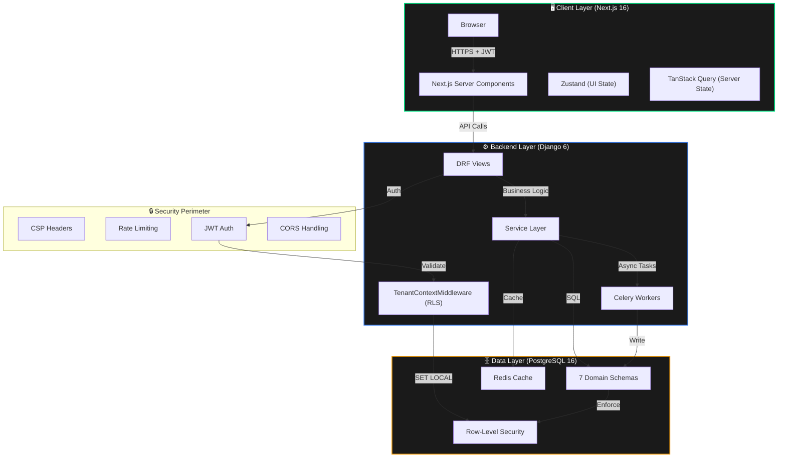
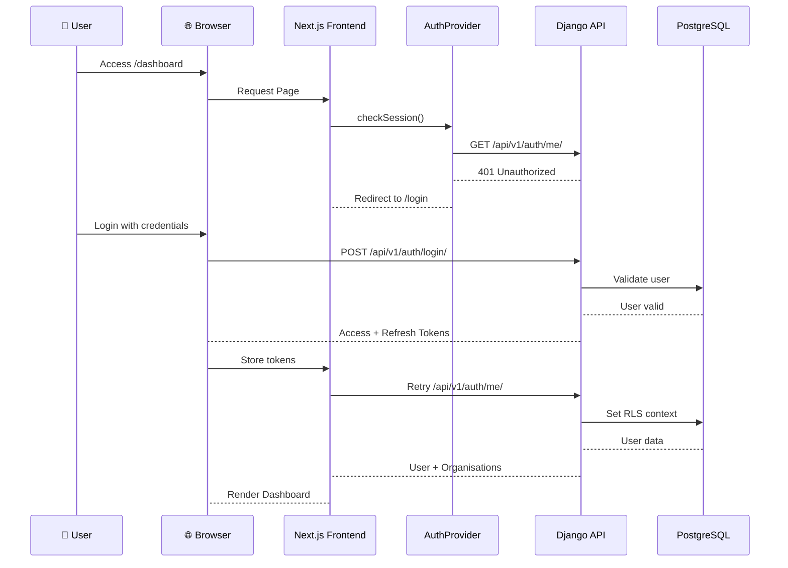
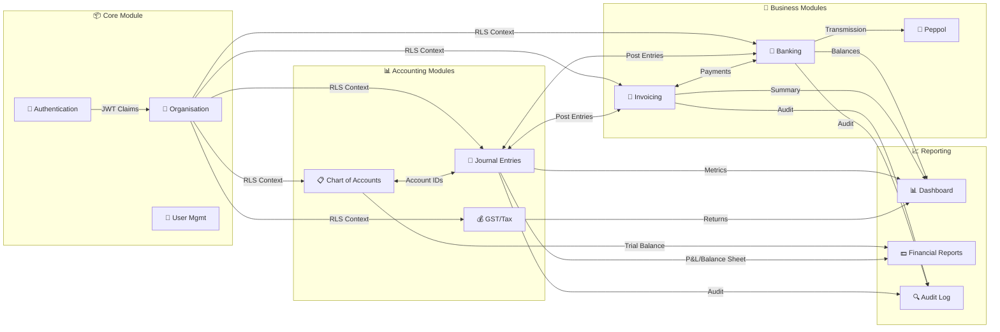
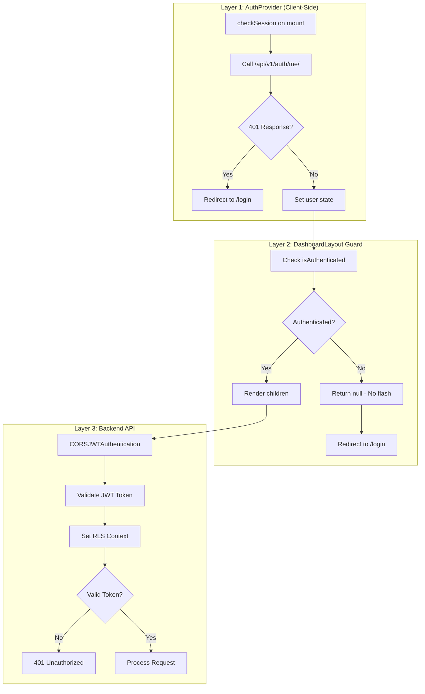
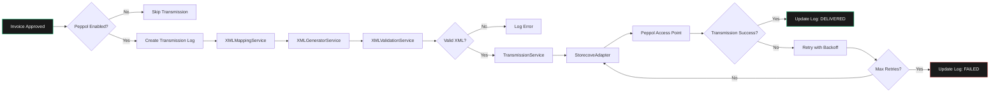
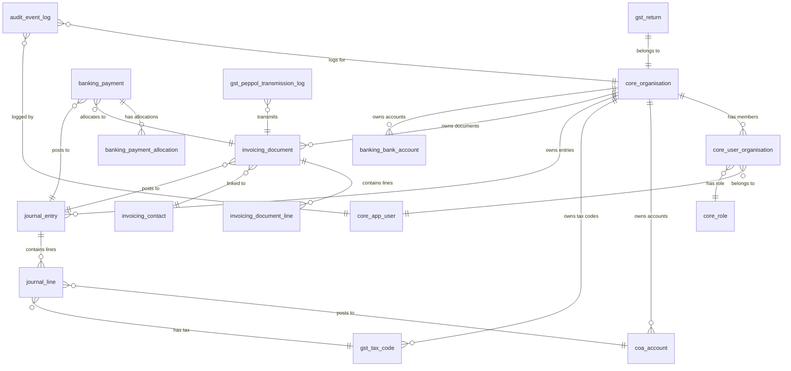

# LedgerSG — Project Architecture Document (PAD)

**Version:** 3.0.0  
**Last Updated:** 2026-03-10  
**Classification:** CONFIDENTIAL — Internal Development Use  
**Status:** ✅ Production Ready

---

## 📋 Table of Contents

1. [Executive Summary](#1-executive-summary)
2. [System Architecture](#2-system-architecture)
3. [Technology Stack](#3-technology-stack)
4. [File Hierarchy](#4-file-hierarchy)
5. [Application Flowcharts](#5-application-flowcharts)
6. [Database Schema](#6-database-schema)
7. [Architectural Principles](#7-architectural-principles)
8. [Security Architecture](#8-security-architecture)
9. [Development Guidelines](#9-development-guidelines)
10. [Testing Strategy](#10-testing-strategy)
11. [Deployment](#11-deployment)
12. [API Reference](#12-api-reference)
13. [Troubleshooting](#13-troubleshooting)

---

## 1. Executive Summary

### 1.1 Project Overview

**LedgerSG** is a production-grade, double-entry accounting platform purpose-built for Singapore Small and Medium Businesses (SMBs). It transforms IRAS 2026 compliance from a regulatory burden into a seamless, automated experience while delivering a distinctive "Illuminated Carbon" neo-brutalist user interface.

### 1.2 Core Mission

> Transform IRAS compliance from a burden into a seamless, automated experience while delivering a distinctive, anti-generic user interface that makes financial data approachable yet authoritative.

### 1.3 Current Status (2026-03-10)

| Component | Version | Status | Key Metrics |
|-----------|---------|--------|-------------|
| **Frontend** | v0.1.2 | ✅ Production Ready | 12 pages, 321 tests, WCAG AAA |
| **Backend** | v0.3.3 | ✅ Production Ready | 87 endpoints, 468 tests |
| **Database** | v1.0.3 | ✅ Complete | 7 schemas, 30 tables, RLS enforced |
| **Security** | v1.0.0 | ✅ 100% Score | SEC-001, SEC-002, SEC-003 Remediated |
| **Total Tests** | — | ✅ 789 Passing | 321 Frontend + 468 Backend |
| **Overall** | — | ✅ Platform Ready | IRAS Compliant, Production Deployed |

### 1.4 Key Achievements

- ✅ **IRAS 2026 Compliance** — GST F5, InvoiceNow/Peppol, BCRS all implemented
- ✅ **100% Security Score** — All HIGH/MEDIUM findings remediated
- ✅ **789 Tests Passing** — Comprehensive TDD coverage across frontend/backend
- ✅ **SQL-First Architecture** — PostgreSQL schema as single source of truth
- ✅ **Zero JWT Exposure** — Server Components fetch data server-side
- ✅ **Row-Level Security** — Multi-tenant isolation at database level

---

## 2. System Architecture

### 2.1 High-Level Application Flow



### 2.2 User Authentication Flow



### 2.3 Module Interaction Diagram



---

## 3. Technology Stack

### 3.1 Frontend

| Layer | Technology | Version | Purpose |
|-------|------------|---------|---------|
| Framework | Next.js (App Router) | 16.1.6 | SSR, SSG, API routes |
| UI Library | React | 19.2.3 | Component architecture |
| Styling | Tailwind CSS | 4.0 | CSS-first theming |
| UI Primitives | Shadcn/Radix | Latest | Accessible components |
| State Management | Zustand | 5.0.11 | UI state |
| Server State | TanStack Query | 5.90.21 | API caching |
| Testing | Vitest + RTL | 4.0.18 | Unit tests |
| E2E Testing | Playwright | 1.58.2 | End-to-end tests |
| Validation | Zod | 4.3.6 | Schema validation |

### 3.2 Backend

| Layer | Technology | Version | Purpose |
|-------|------------|---------|---------|
| Framework | Django | 6.0.2 | Web framework |
| API | Django REST Framework | 3.16.1 | REST endpoints |
| Auth | djangorestframework-simplejwt | 5.5.1 | JWT authentication |
| Database | PostgreSQL | 16+ | Primary data store |
| Task Queue | Celery + Redis | 5.6.2 / 6.4.0 | Async processing |
| PDF Engine | WeasyPrint | 68.1 | Document generation |
| Testing | pytest-django | 4.12.0 | Unit/integration tests |
| Security | django-csp | 4.0 | Content Security Policy |
| Rate Limiting | django-ratelimit | 4.1.0 | Auth endpoint protection |

### 3.3 Infrastructure

| Component | Technology | Version | Purpose |
|-----------|------------|---------|---------|
| Container | Docker | Latest | Multi-service deployment |
| Database | PostgreSQL | 16+ | RLS, NUMERIC precision |
| Cache | Redis | 6.4.0 | Celery broker, caching |
| CI/CD | GitHub Actions | Latest | Automated testing |
| Monitoring | Sentry | 2.53.0 | Error tracking |

---

## 4. File Hierarchy

```
Ledger-SG/
├── 📂 apps/
│   ├── 📂 backend/                    # Django 6.0.2 Application
│   │   ├── 📂 apps/                  # Domain Modules
│   │   │   ├── 📂 banking/              # Bank Accounts, Payments, Recon
│   │   │   │   ├── services.py       # Banking service layer
│   │   │   │   ├── views.py          # Banking API endpoints
│   │   │   │   ├── urls.py           # Banking URL patterns
│   │   │   │   ├── serializers.py    # Banking serializers
│   │   │   │   └── tests/            # Banking tests
│   │   │   ├── 📂 coa/               # Chart of Accounts
│   │   │   ├── 📂 core/              # Auth, Organisations, Users
│   │   │   │   ├── services/
│   │   │   │   │   └── auth_service.py    # Authentication logic
│   │   │   │   ├── authentication.py   # CORSJWTAuthentication class
│   │   │   │   └── models/ 
│   │   │   │       ├── organisation.py # Organisation model
│   │   │   │       └── user.py       # User model
│   │   │   ├── 📂 gst/               # GST management, tax codes, F5 returns
│   │   │   ├── 📂 invoicing/          # Invoices, Credit Notes, Contacts
│   │   │   ├── 📂 journal/           # General Ledger (Double Entry)
│   │   │   ├── 📂 peppol/            # InvoiceNow Integration
│   │   │   │   ├── services/
│   │   │   │   │   ├── xml_mapping_service.py
│   │   │   │   │   ├── xml_generator_service.py
│   │   │   │   │   ├── xml_validation_service.py
│   │   │   │   │   ├── ap_adapter_base.py
│   │   │   │   │   ├── ap_storecove_adapter.py
│   │   │   │   │   └── transmission_service.py
│   │   │   │   ├── tasks.py          # Celery tasks
│   │   │   │   └── tests/
│   │   │   └── 📂 reporting/         # Dashboard & Financial Reports
│   │   │       └── services/
│   │   │           └── dashboard_service.py
│   │   ├── 📂 common/                # Shared Utilities (Money, Base Models)
│   │   │   ├── middleware/
│   │   │   │   └── tenant_context.py # ⭐ RLS middleware (CRITICAL)
│   │   │   └── decimal_utils.py      # ⭐ money() function
│   │   ├── 📂 config/                # Django Configuration
│   │   │   ├── settings/
│   │   │   │   ├── base.py           # Main settings with CSP config
│   │   │   │   ├── development.py
│   │   │   │   ├── production.py
│   │   │   │   └── testing.py
│   │   │   ├── urls.py               # Root URL configuration
│   │   │   └── celery.py             # Celery configuration
│   │   ├── 📂 tests/                 # Test Suites
│   │   │   ├── middleware/           # RLS middleware tests
│   │   │   ├── integration/          # Integration tests
│   │   │   └── security/             # Security tests (CSP, rate limiting)
│   │   ├── database_schema.sql       # ⭐ SOURCE OF TRUTH
│   │   ├── pyproject.toml            # Python dependencies
│   │   └── manage.py                 # Django Management
│   │
│   └── 📂 web/                       # Next.js 16.1.6 Application
│       ├── 📂 src/
│       │   ├── 📂 app/                # App Router (Pages & Layouts)
│       │   │   ├── (auth)/           # Authentication routes
│       │   │   │   ├── login/
│       │   │   │   └── register/
│       │   │   ├── (dashboard)/      # Protected dashboard routes
│       │   │   │   ├── banking/      # Banking UI page
│       │   │   │   ├── invoices/     # Invoices management
│       │   │   │   ├── dashboard/    # Dashboard page
│       │   │   │   └── settings/     # Organisation settings
│       │   │   └── api/              # Next.js API routes
│       │   ├── 📂 components/        # React components
│       │   │   ├── banking/          # Banking UI components
│       │   │   ├── ui/               # Shadcn/Radix UI components
│       │   │   └── layout/           # Layout components (Shell, Nav)
│       │   ├── 📂 hooks/             # Custom React hooks
│       │   │   ├── use-banking.ts    # Banking data hooks
│       │   │   ├── use-auth.ts       # Authentication hooks
│       │   │   └── use-toast.ts      # Toast notifications
│       │   ├── 📂 lib/
│       │   │   ├── api-client.ts     # Typed API client
│       │   │   └── server/
│       │   │       └── api-client.ts # Server-side API client
│       │   ├── 📂 providers/         # Context providers (Auth, Theme)
│       │   │   └── auth-provider.tsx # Authentication context
│       │   └── 📂 shared/
│       │       └── schemas/          # Zod schemas & Types
│       │           ├── bank-account.ts
│       │           ├── payment.ts
│       │           └── index.ts
│       ├── middleware.ts             # CSP & Security Headers
│       ├── next.config.ts            # Next.js Configuration
│       ├── package.json              # Node dependencies
│       └── vitest.config.ts          # Vitest configuration
│
├── 📂 docker/                        # Docker Configuration
│   ├── Dockerfile
│   └── entrypoint.sh
│
├── 📂 docs/                          # Documentation
│
├── 📄 Project_Architecture_Document.md  # This file
├── 📄 README.md                      # Project overview
├── 📄 AGENT_BRIEF.md                 # Developer guidelines
├── 📄 CLAUDE.md                      # Developer briefing
├── 📄 ACCOMPLISHMENTS.md             # Project milestones
├── 📄 API_CLI_Usage_Guide.md         # Complete API reference
├── 📄 SECURITY_AUDIT.md              # Security audit report
├── 📄 start_apps.sh                  # Application startup script
└── 📄 LICENSE                        # AGPL-3.0 license
```

### 4.1 Key Files & Their Purpose

| File Path | Description | Critical Notes |
|-----------|-------------|----------------|
| `apps/backend/database_schema.sql` | ⭐ PostgreSQL schema source of truth | Never use `makemigrations` |
| `apps/backend/common/middleware/tenant_context.py` | RLS context middleware | Sets `app.current_org_id` |
| `apps/backend/apps/core/authentication.py` | CORSJWTAuthentication class | Handles OPTIONS preflight |
| `apps/backend/common/decimal_utils.py` | Financial precision utilities | Use `money()` function |
| `apps/web/src/lib/api-client.ts` | Typed API client | Server-side auth |
| `apps/web/src/providers/auth-provider.tsx` | Authentication context | 3-layer defense |
| `apps/web/middleware.ts` | Next.js middleware | CSP headers |
| `apps/backend/config/settings/base.py` | Django settings | CSP, rate limiting, CORS |
| `apps/backend/apps/peppol/services/` | InvoiceNow services | XML generation, validation, transmission |
| `apps/backend/apps/reporting/services/dashboard_service.py` | Dashboard calculations | Real data aggregation |

---

## 5. Application Flowcharts

### 5.1 Request Processing Flow

```mermaid
flowchart LR
    A[Browser Request] --> B[Next.js Server Component]
    B --> C{Authenticated?}
    C -->|No| D[Redirect to /login]
    C -->|Yes| E[Server-Side API Call]
    E --> F[Django CORSJWTAuthentication]
    F --> G{OPTIONS Request?}
    G -->|Yes| H[Return None - Allow CORS]
    G -->|No| I[Validate JWT Token]
    I --> J[TenantContextMiddleware]
    J --> K[SET LOCAL app.current_org_id]
    K --> L[DRF View]
    L --> M[Service Layer]
    M --> N[PostgreSQL with RLS]
    N --> O[Return JSON Response]
    O --> P[Render Server Component]
    P --> Q[Send HTML to Browser]
    
    style A fill:#1a1a1a,stroke:#00E585,color:#fff
    style Q fill:#1a1a1a,stroke:#00E585,color:#fff
    style N fill:#1a1a1a,stroke:#f59e0b,color:#fff
```



### 5.2 Authentication Flow (3-Layer Defense)



### 5.3 InvoiceNow/Peppol Transmission Flow



---

## 6. Database Schema

### 6.1 Schema Overview

LedgerSG uses **7 domain-specific PostgreSQL schemas** for logical separation:

| Schema | Purpose | Key Tables | Table Count |
|--------|---------|------------|-------------|
| `core` | Multi-tenancy, users, roles | organisation, app_user, user_organisation, fiscal_year, fiscal_period | 10 |
| `coa` | Chart of Accounts | account, account_type, account_sub_type | 3 |
| `gst` | GST compliance, tax codes, F5 returns | tax_code, return, threshold_snapshot, peppol_transmission_log | 4 |
| `journal` | General Ledger (immutable) | entry, line | 2 |
| `invoicing` | Sales/purchases, contacts | contact, document, document_line, document_attachment | 5 |
| `banking` | Cash management | bank_account, payment, payment_allocation, bank_transaction | 4 |
| `audit` | Immutable audit trail | event_log, org_event_log (view) | 2 |
| **Total** | | | **30 tables** |

### 6.2 Key Table Relationships



### 6.3 Row-Level Security (RLS)

**All tenant-scoped tables have RLS enabled** with the following policy pattern:

```sql
-- Enable RLS
ALTER TABLE invoicing.document ENABLE ROW LEVEL SECURITY;
ALTER TABLE invoicing.document FORCE ROW LEVEL SECURITY;

-- SELECT policy
CREATE POLICY rls_select_document ON invoicing.document
    FOR SELECT USING (org_id = core.current_org_id());

-- INSERT policy
CREATE POLICY rls_insert_document ON invoicing.document
    FOR INSERT WITH CHECK (org_id = core.current_org_id());

-- UPDATE policy
CREATE POLICY rls_update_document ON invoicing.document
    FOR UPDATE USING (org_id = core.current_org_id());

-- DELETE policy
CREATE POLICY rls_delete_document ON invoicing.document
    FOR DELETE USING (org_id = core.current_org_id());
```

**Session Variable Setting (via Middleware):**

```python
# apps/backend/common/middleware/tenant_context.py
cursor.execute("SET LOCAL app.current_org_id = %s", [str(org_id)])
cursor.execute("SET LOCAL app.current_user_id = %s", [str(user_id)])
```

### 6.4 Financial Precision

**All monetary columns use `NUMERIC(10,4)`:**

```sql
-- Example from database_schema.sql
CREATE TABLE invoicing.document_line (
    -- ...
    unit_price      NUMERIC(10,4) NOT NULL,
    line_amount     NUMERIC(10,4) NOT NULL,
    gst_amount      NUMERIC(10,4) NOT NULL,
    total_amount    NUMERIC(10,4) NOT NULL,
    -- ...
);
```

**Python Utility (No Floats Allowed):**

```python
# apps/backend/common/decimal_utils.py
def money(value) -> Decimal:
    """Convert value to Decimal with 4 decimal places. Rejects floats."""
    if isinstance(value, float):
        raise TypeError(f"Float {value} is not allowed. Use str or Decimal.")
    return Decimal(str(value)).quantize(Decimal("0.0001"), rounding=ROUND_HALF_UP)
```

---

## 7. Architectural Principles

### 7.1 SQL-First & Unmanaged Models

**The PostgreSQL schema (`database_schema.sql`) is the absolute source of truth.**

- ✅ All Django models use `managed = False`
- ✅ Never run `python manage.py makemigrations`
- ✅ Schema changes require manual SQL patches
- ✅ Models must align with DDL-defined columns

```python
# Example: Unmanaged model
class InvoiceDocument(TenantModel):
    class Meta:
        managed = False
        db_table = 'invoicing"."document'
        schema = 'invoicing'
```

### 7.2 Service Layer Pattern

**All business logic resides in `services/` modules. Views are thin controllers.**

```python
# ❌ WRONG - Business logic in view
class InvoiceView(APIView):
    def post(self, request, org_id):
        invoice = InvoiceDocument.objects.create(...)
        JournalService.post_invoice(...)  # Business logic in view

# ✅ RIGHT - Business logic in service
class InvoiceView(APIView):
    def post(self, request, org_id):
        serializer = InvoiceSerializer(data=request.data)
        serializer.is_valid(raise_exception=True)
        invoice = DocumentService.create_document(org_id, serializer.validated_data)
        return Response(InvoiceSerializer(invoice).data, status=201)
```

### 7.3 Defense-in-Depth Security

| Layer | Implementation | Purpose |
|-------|----------------|---------|
| Layer 1 | AuthProvider redirect | Client-side auth check |
| Layer 2 | DashboardLayout guard | Prevent flash of protected content |
| Layer 3 | Backend JWT validation | Server-side token validation |
| Layer 4 | PostgreSQL RLS | Database-level tenant isolation |

### 7.4 Zero JWT Exposure

**Access tokens are NEVER exposed to browser JavaScript:**

- ✅ Server Components fetch data server-side
- ✅ Refresh tokens stored in HttpOnly cookies
- ✅ Access tokens held in server memory during SSR
- ✅ Client-side uses server-fetch pattern

---

## 8. Security Architecture

### 8.1 Security Score: 100%

| Security Domain | Score | Status |
|-----------------|-------|--------|
| Authentication & Session Management | 100% | ✅ Pass |
| Authorization & Access Control | 100% | ✅ Pass |
| Multi-Tenancy & RLS | 100% | ✅ Pass |
| Input Validation & Sanitization | 100% | ✅ Pass |
| Output Encoding & XSS Prevention | 100% | ✅ Pass |
| SQL Injection Prevention | 100% | ✅ Pass |
| CSRF Protection | 100% | ✅ Pass |
| Cryptographic Storage | 100% | ✅ Pass |
| Error Handling & Logging | 100% | ✅ Pass |
| Data Protection & Privacy | 100% | ✅ Pass |

### 8.2 Security Findings & Remediation

| ID | Finding | Severity | Status | Remediation |
|----|---------|----------|--------|-------------|
| SEC-001 | Banking stubs return unvalidated input | HIGH | ✅ Remediated | Full service layer implementation |
| SEC-002 | No rate limiting on authentication | MEDIUM | ✅ Remediated | django-ratelimit on auth endpoints |
| SEC-003 | Content Security Policy not configured | MEDIUM | ✅ Remediated | django-csp v4.0 with strict directives |
| SEC-004 | Frontend test coverage minimal | MEDIUM | ⚠️ In Progress | Expanding Vitest coverage |
| SEC-005 | PII encryption at rest not implemented | LOW | 📋 Future | pgcrypto for sensitive fields |

### 8.3 Rate Limiting

| Endpoint | Rate Limit | Key | Purpose |
|----------|------------|-----|---------|
| `/api/v1/auth/register/` | 5/hour | IP | Prevent mass registration |
| `/api/v1/auth/login/` | 10/min | IP | Prevent brute-force |
| `/api/v1/auth/login/` | 30/min | User | Per-user limit |
| `/api/v1/auth/refresh/` | 20/min | IP | Prevent token abuse |
| All other endpoints | 100/min | User | General API protection |

### 8.4 Content Security Policy

**Backend CSP (django-csp v4.0):**

```python
# apps/backend/config/settings/base.py
CONTENT_SECURITY_POLICY_REPORT_ONLY = {
    "DIRECTIVES": {
        "default-src": ["'none'"],
        "script-src": ["'self'"],
        "style-src": ["'self'", "'unsafe-inline'"],  # Django admin compatibility
        "img-src": ["'self'", "data:", "blob:"],
        "font-src": ["'self'", "data:"],
        "connect-src": ["'self'"],
        "object-src": ["'none'"],
        "base-uri": ["'self'"],
        "frame-ancestors": ["'none'"],
        "frame-src": ["'none'"],
        "form-action": ["'self'"],
        "upgrade-insecure-requests": [],
        "report-uri": ["/api/v1/security/csp-report/"],
    }
}
```

**CSP Report Endpoint:**

```python
# apps/backend/apps/core/views/security.py
@api_view(["POST"])
@permission_classes([AllowAny])  # Browsers send CSP reports without auth
def csp_report_view(request):
    violation_data = request.data
    logger.warning("CSP Violation Detected", extra={"violation": violation_data})
    return HttpResponse(status=204)
```

---

## 9. Development Guidelines

### 9.1 The Meticulous Approach

**All contributions must follow:** `ANALYZE → PLAN → VALIDATE → IMPLEMENT → VERIFY → DELIVER`

### 9.2 Backend Development Standards

```python
# ✅ DO: Use service layer for business logic
from apps.invoicing.services import DocumentService

invoice = DocumentService.create_document(org_id, validated_data)

# ❌ DON'T: Put business logic in views
invoice = InvoiceDocument.objects.create(...)  # Wrong

# ✅ DO: Use money() utility for currency
from common.decimal_utils import money

amount = money("1000.0000")

# ❌ DON'T: Use floats for money
amount = 1000.00  # Wrong

# ✅ DO: Use transaction.atomic() for writes
with transaction.atomic():
    invoice = DocumentService.create_document(...)
    JournalService.post_invoice(...)

# ❌ DON'T: Run makemigrations
python manage.py makemigrations  # NEVER

# ✅ DO: Update database_schema.sql first
# Then align Django models with managed = False
```

### 9.3 Frontend Development Standards

```typescript
// ✅ DO: Use Server Components for data fetching
// apps/web/src/app/(dashboard)/dashboard/page.tsx
export default async function DashboardPage() {
  const data = await fetchDashboardData(orgId);
  return <DashboardClient data={data} />;
}

// ✅ DO: Use Shadcn/Radix primitives
import { Button } from "@/components/ui/button";

// ❌ DON'T: Rebuild UI components from scratch
<button className="custom-button">  // Wrong

// ✅ DO: Use TanStack Query v5 patterns
const { data, isPending } = useQuery({
  queryKey: ['invoices', orgId],
  queryFn: () => api.get(`/api/v1/${orgId}/invoicing/documents/`),
});

// ❌ DON'T: Use isLoading for mutations (v5 uses isPending)
const { isPending } = useMutation({...});  // Correct
const { isLoading } = useMutation({...});  // Wrong in v5

// ✅ DO: Use userEvent for Radix UI testing
const user = userEvent.setup();
await user.click(tab);

// ❌ DON'T: Use fireEvent for Radix UI
fireEvent.click(tab);  // Won't trigger state changes
```

### 9.4 UUID Handling

**Django URL converters auto-convert to UUID objects:**

```python
# ✅ CORRECT - Use org_id directly
def get(self, request, org_id: str):
    accounts = BankAccountService.list(org_id=org_id)

# ❌ WRONG - Double conversion causes error
def get(self, request, org_id: str):
    accounts = BankAccountService.list(org_id=UUID(org_id))  # Error!
```

**Error Message:** `'UUID' object has no attribute 'replace'`

---

## 10. Testing Strategy

### 10.1 Test-Driven Development (TDD)

**All critical business logic follows:** `RED → GREEN → REFACTOR`

1. **RED:** Write failing test first
2. **GREEN:** Implement minimal code to pass test
3. **REFACTOR:** Optimize code while keeping tests green

### 10.2 Backend Testing Workflow

**Standard Django test runners fail on unmanaged models. Manual database initialization is required:**

```bash
# 1. Manually initialize the test database
export PGPASSWORD=ledgersg_secret_to_change
dropdb -h localhost -U ledgersg test_ledgersg_dev || true
createdb -h localhost -U ledgersg test_ledgersg_dev
psql -h localhost -U ledgersg -d test_ledgersg_dev -f database_schema.sql

# 2. Run tests with reuse flags
source /opt/venv/bin/activate
cd apps/backend
pytest --reuse-db --no-migrations -v
```

**Expected Output:**
```
============================= 468 passed in 37.79s =============================
```

### 10.3 Frontend Testing Workflow

```bash
cd apps/web

# Run all tests
npm test

# Run with coverage
npm run test:coverage

# Run E2E tests
npm run test:e2e

# Run specific test file
npm test -- src/app/(dashboard)/banking/tests/page.test.tsx
```

**Expected Output:**
```
Test Files  22 passed (22)
Tests       321 passed (321)
Duration    22.69s
```

### 10.4 Test Coverage by Module

| Module | Tests | Coverage | Status |
|--------|-------|----------|--------|
| Frontend Unit | 321 | 100% | ✅ Passing |
| Backend Core | 385 | 84% | ✅ Passing |
| Backend Domain | 74 | 98% | ✅ Passing |
| InvoiceNow TDD | 122+ | 100% | ✅ Passing |
| Banking UI TDD | 73 | 100% | ✅ Passing |
| Dashboard TDD | 36 | 100% | ✅ Passing |
| CSP Tests | 15 | 100% | ✅ Passing |
| **Total** | **789** | **100%** | ✅ **All Passing** |

---

## 11. Deployment

### 11.1 Environment Variables

**Backend (`.env`):**

| Variable | Required | Default | Description |
|----------|----------|---------|-------------|
| `SECRET_KEY` | ✅ | — | Django secret key |
| `DATABASE_URL` | ✅ | — | PostgreSQL connection string |
| `REDIS_URL` | ✅ | — | Redis connection for Celery |
| `DEBUG` | ❌ | False | Debug mode |
| `ALLOWED_HOSTS` | ✅ | — | Comma-separated host list |
| `CORS_ALLOWED_ORIGINS` | ✅ | — | Frontend origins |

**Frontend (`.env.local`):**

| Variable | Required | Default | Description |
|----------|----------|---------|-------------|
| `NEXT_PUBLIC_API_URL` | ✅ | http://localhost:8000 | Backend API URL |
| `NEXT_OUTPUT_MODE` | ❌ | standalone | standalone or export |
| `NEXT_PUBLIC_ENABLE_PEPPOL` | ❌ | true | InvoiceNow feature flag |
| `NEXT_PUBLIC_ENABLE_GST_F5` | ❌ | true | GST F5 feature flag |
| `NEXT_PUBLIC_ENABLE_BCRS` | ❌ | true | BCRS feature flag |

### 11.2 Build Modes

| Mode | Command | Backend API | Purpose |
|------|---------|-------------|---------|
| Development | `npm run dev` | ✅ Full | Hot reload, debugging |
| Production Server | `npm run build:server && npm run start` | ✅ Full | Standalone server |
| Static Export | `npm run build && npm run serve` | ❌ None | CDN deployment |

### 11.3 Docker Deployment

```bash
# Build the image
docker build -f docker/Dockerfile -t ledgersg:latest docker/

# Run with all services
docker run -p 3000:3000 -p 8000:8000 -p 5432:5432 -p 6379:6379 ledgersg:latest
```

**Service Ports:**

| Service | Port | Description |
|---------|------|-------------|
| Next.js Frontend | 3000 | Web UI with API integration |
| Django Backend | 8000 | REST API endpoints |
| PostgreSQL | 5432 | Database with RLS |
| Redis | 6379 | Celery task queue |

### 11.4 Production Deployment Checklist

- [ ] Change `ledgersg_owner` and `ledgersg_app` passwords
- [ ] Configure production credentials (Storecove, IRAS API)
- [ ] SSL certificate setup
- [ ] Celery worker scaling
- [ ] Monitoring & alerting (Sentry configured)
- [ ] CSP enforcement mode (switch from report-only)
- [ ] Load testing with >100k invoices
- [ ] PII encryption at rest (SEC-005)

---

## 12. API Reference

### 12.1 Endpoint Summary

| Module | Endpoints | Status |
|--------|-----------|--------|
| Authentication | 10 | ✅ Production (SEC-002) |
| Organizations | 11 | ✅ Production (Phase B) |
| Chart of Accounts | 8 | ✅ Production |
| GST | 13 | ✅ Production |
| Invoicing | 16 | ✅ Production |
| Journal | 9 | ✅ Production |
| Banking | 13 | ✅ Production (SEC-001) |
| Peppol (InvoiceNow) | 2 | ✅ Production |
| Dashboard/Reports | 3 | ✅ Production |
| Security/Infrastructure | 3 | ✅ Production (SEC-003) |
| **Total** | **87** | ✅ **All Validated** |

### 12.2 Key Endpoints

**Authentication:**
```bash
POST /api/v1/auth/login/          # User authentication
POST /api/v1/auth/logout/         # Session termination
POST /api/v1/auth/refresh/        # Token refresh
GET  /api/v1/auth/me/             # Current user profile
```

**Organisation:**
```bash
GET  /api/v1/organisations/       # List organisations
POST /api/v1/organisations/       # Create organisation
GET  /api/v1/{orgId}/             # Organisation details
GET  /api/v1/{orgId}/settings/    # Organisation settings
```

**Invoicing:**
```bash
GET  /api/v1/{orgId}/invoicing/documents/              # List invoices
POST /api/v1/{orgId}/invoicing/documents/              # Create invoice
POST /api/v1/{orgId}/invoicing/documents/{id}/approve/ # Approve invoice
GET  /api/v1/{orgId}/invoicing/documents/{id}/pdf/     # Download PDF
```

**Banking:**
```bash
GET  /api/v1/{orgId}/banking/bank-accounts/                  # List bank accounts
POST /api/v1/{orgId}/banking/payments/receive/              # Receive payment
POST /api/v1/{orgId}/banking/payments/{id}/allocate/        # Allocate payment
POST /api/v1/{orgId}/banking/bank-transactions/import/      # Import CSV
POST /api/v1/{orgId}/banking/bank-transactions/{id}/reconcile/  # Reconcile
```

**Dashboard:**
```bash
GET /api/v1/{orgId}/reports/dashboard/metrics/   # Dashboard metrics
GET /api/v1/{orgId}/reports/dashboard/alerts/    # Compliance alerts
GET /api/v1/{orgId}/reports/reports/financial/   # Financial reports
```

**Peppol (InvoiceNow):**
```bash
GET  /api/v1/{orgId}/peppol/transmission-log/    # Transmission log
GET/PATCH /api/v1/{orgId}/peppol/settings/       # Peppol settings
```

**Full API documentation:** See [`API_CLI_Usage_Guide.md`](API_CLI_Usage_Guide.md)

---

## 13. Troubleshooting

### 13.1 Backend Issues

| Problem | Cause | Solution |
|---------|-------|----------|
| `relation "core.app_user" does not exist` | Test database empty | Load `database_schema.sql` manually |
| Dashboard API returns 403 | `UserOrganisation.accepted_at` is null | Set `accepted_at` in fixtures |
| `check_tax_code_input_output` constraint fails | Missing direction flags | Set `is_input=True` or `is_output=True` |
| Circular dependency on DB init | FK order wrong | FKs added via `ALTER TABLE` at end |
| `UUID object has no attribute 'replace'` | Double UUID conversion | Remove `UUID(org_id)` calls in views |
| `column "X" does not exist` (ghost column) | Model inherits `TenantModel` but table lacks timestamps | Change inheritance to `models.Model` |
| `FieldError: Cannot resolve keyword 'is_voided'` | Service queries non-existent column | Remove invalid filter; use document status instead |
| `pytest_plugins` in non-root conftest | Invalid pytest configuration | Remove from `apps/peppol/tests/conftest.py` |

### 13.2 Frontend Issues

| Problem | Cause | Solution |
|---------|-------|----------|
| "Loading..." stuck on dashboard | Missing static files | Rebuild: `npm run build:server` |
| 404 errors for JS chunks | Static files not copied | Build script auto-copies now |
| Hydration mismatch errors | Client/Server render differs | Convert to Server Component |
| API connection failed | CORS or URL misconfigured | Check `.env.local` and backend CORS |
| Radix Tabs not activating in tests | `fireEvent.click` doesn't work | Use `userEvent.setup()` + `await user.click()` |
| Net Profit shows 0.0000 | Invoice not approved | Call `/approve/` endpoint (mandatory for ledger) |
| `TypeError: Object of type UUID is not JSON serializable` | Missing serializer support | Fixed in latest release (encoder handles UUID) |

### 13.3 CORS & Authentication

| Problem | Cause | Solution |
|---------|-------|----------|
| OPTIONS requests return 401 | JWT auth rejecting preflight | `CORSJWTAuthentication` handles this |
| Dashboard shows "No Organisation" | User not authenticated | Redirect to `/login` implemented |
| Token refresh fails | Refresh token expired | Re-login required |
| Auth token refresh silently fails | Frontend expects `data.access` but backend returns `data.tokens.access` | Fixed in `api-client.ts` – now handles both structures |

### 13.4 Testing Issues

| Problem | Cause | Solution |
|---------|-------|----------|
| pytest tries to run migrations | Unmanaged models | Use `--reuse-db --no-migrations` |
| Test fixtures fail SQL constraints | Invalid fixture data | Update fixtures per SQL schema |
| Frontend tests fail | Missing dependencies | Run `npm install` in `apps/web` |
| Multiple elements found error | Selector matches multiple | Use `findAllByRole` instead of `findByRole` |
| Hook returns undefined | Missing mock in test | Add `vi.mocked(hooks.useXxx).mockReturnValue(...)` |

### 13.5 CSP-Specific Troubleshooting

| Problem | Cause | Solution |
|---------|-------|----------|
| CSP Headers Not Appearing | Tests failing with no CSP headers in response | Check django-csp version (v4.0+ uses dict-based config) |
| CSP Report Endpoint Returns 401 | Browser sends CSP reports without auth tokens | Use `@permission_classes([AllowAny])` for the report endpoint |
| report-uri Missing from CSP Header | django-csp doesn't auto-append report-uri from settings | Explicitly add `"report-uri": ["/api/v1/security/csp-report/"]` to DIRECTIVES dict |
| django-csp Module Not Found | `ImportError: No module named 'csp.middleware'` | Add `'csp'` to `INSTALLED_APPS` in `settings/base.py` |
| CSP Breaks Django Admin | Admin pages not loading properly with CSP | Use report-only mode first, monitor violations, then consider adding `'unsafe-inline'` to `script-src` if needed for admin-only usage |
| Tests Passing Locally But Failing in CI | CSP configuration differences between environments | Ensure `CONTENT_SECURITY_POLICY_REPORT_ONLY` is set in both `base.py` and `testing.py` settings |

---

## Appendix A: Quick Reference Commands

### Backend

```bash
# Initialize test database
export PGPASSWORD=ledgersg_secret_to_change
dropdb -h localhost -U ledgersg test_ledgersg_dev || true
createdb -h localhost -U ledgersg test_ledgersg_dev
psql -h localhost -U ledgersg -d test_ledgersg_dev -f database_schema.sql

# Run backend tests
cd apps/backend
source /opt/venv/bin/activate
pytest --reuse-db --no-migrations -v

# Start backend server
python manage.py runserver 0.0.0.0:8000

# Check deployment configuration
python manage.py check --deploy
```

### Frontend

```bash
# Install dependencies
cd apps/web
npm install

# Run tests
npm test

# Run E2E tests
npm run test:e2e

# Development server
npm run dev

# Production build
npm run build:server
npm run start
```

### Database

```bash
# List all schemas
psql -h localhost -U ledgersg -d ledgersg_dev -c "\dn"

# List tables in schema
psql -h localhost -U ledgersg -d ledgersg_dev -c "\dt core.*"

# Verify RLS policies
psql -h localhost -U ledgersg -d ledgersg_dev -c "SELECT schemaname, tablename, policyname FROM pg_policies WHERE schemaname IN ('core', 'invoicing', 'banking');"
```

---

## Appendix B: Document Cross-Reference

| Document | Purpose | Audience |
|----------|---------|----------|
| [`README.md`](README.md) | Project overview, quick start | All developers |
| [`AGENT_BRIEF.md`](AGENT_BRIEF.md) | Developer guidelines, patterns | Coding agents, developers |
| [`CLAUDE.md`](CLAUDE.md) | Developer briefing, troubleshooting | Developers working on features |
| [`ACCOMPLISHMENTS.md`](ACCOMPLISHMENTS.md) | Feature completion log, milestones | Project managers, stakeholders |
| [`API_CLI_Usage_Guide.md`](API_CLI_Usage_Guide.md) | Direct API interaction via CLI | AI agents, backend developers |
| [`SECURITY_AUDIT.md`](SECURITY_AUDIT.md) | Security audit report, findings | Security team, auditors |
| [`API_workflow_examples_and_tips_guide.md`](API_workflow_examples_and_tips_guide.md) | Step-by-step API workflows | Accountants, AI Agents |

---

## Appendix C: Version History

| Version | Date | Changes |
|---------|------|---------|
| 3.0.0 | 2026-03-10 | Initial comprehensive PAD |
| 2.3.0 | 2026-03-09 | Updated with InvoiceNow Phases 1-4 |
| 2.2.0 | 2026-03-08 | Added RLS & View Layer Fixes |
| 2.1.0 | 2026-03-07 | Added CORS Fix & SEC-003 CSP |
| 2.0.0 | 2026-03-06 | Added Banking UI Phase 5.5 |
| 1.0.0 | 2026-02-24 | Initial release |

---

**LedgerSG — Built with ❤️ for Singapore SMBs**

**Last Updated:** 2026-03-10  
**Version:** 3.0.0  
**Status:** ✅ Production Ready
