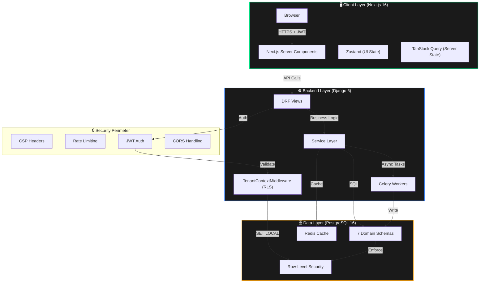
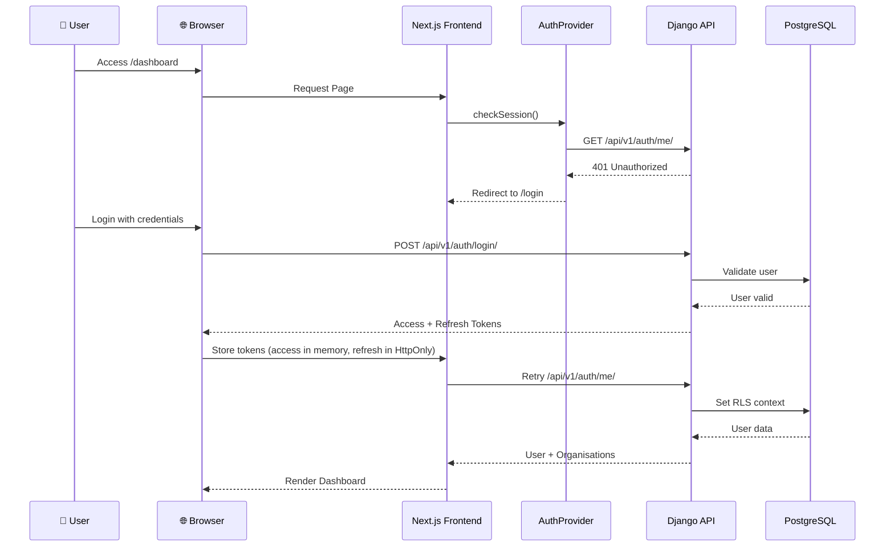
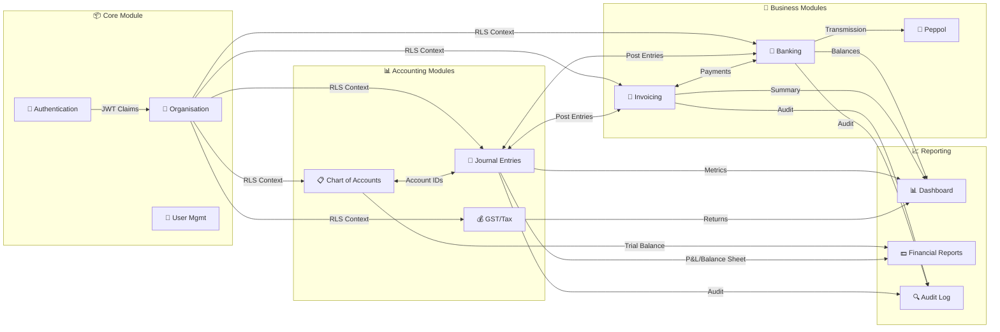

# LedgerSG — Project Architecture Document (PAD)

**Version:** 3.0.0  
**Last Updated:** 2026-03-12  
**Classification:** CONFIDENTIAL – Internal & Agent Use Only  
**Status:** ✅ Production Ready (100% Security Score, 789 Tests, 3 E2E Workflows Verified)  

---

## 📋 Table of Contents

1. [Executive Summary](#-executive-summary)
2. [Architectural Principles](#-architectural-principles)
3. [System Architecture](#-system-architecture)
4. [File Hierarchy & Key Files](#-file-hierarchy--key-files)
5. [Frontend Architecture](#-frontend-architecture)
6. [Backend Architecture](#-backend-architecture)
7. [Database Architecture](#-database-architecture)
8. [Security Architecture](#-security-architecture)
9. [Testing Strategy](#-testing-strategy)
10. [Development Guidelines](#-development-guidelines)
11. [Troubleshooting](#-troubleshooting)
12. [Documentation & References](#-documentation--references)

---

## 🎯 Executive Summary

**LedgerSG** is a production‑grade, double‑entry accounting platform purpose‑built for Singapore SMBs. It transforms IRAS 2026 compliance (GST F5, InvoiceNow, BCRS) into a seamless, automated experience while delivering a distinctive **“Illuminated Carbon” neo‑brutalist** user interface.

### Key Metrics

| Component          | Version   | Status               | Key Metrics                              |
|--------------------|-----------|----------------------|------------------------------------------|
| **Frontend**       | v0.1.2    | ✅ Production Ready   | 12 pages, **321 tests**, WCAG AAA        |
| **Backend**        | v0.3.3    | ✅ Production Ready   | **87 endpoints**, **468 tests**          |
| **Database**       | v1.0.3    | ✅ Complete           | 7 schemas, **30 tables**, RLS enforced   |
| **Accounting Engine** | v1.0.0 | ✅ Verified           | **3/3 E2E Workflows** passing            |
| **Security**       | v1.0.0    | ✅ **100% Score**      | SEC‑001, SEC‑002, SEC‑003 remediated     |
| **InvoiceNow**     | v1.0.0    | ✅ Complete           | **122+ TDD tests**, PINT‑SG compliant    |
| **Total Tests**    | —         | ✅ **789**            | 321 frontend + 468 backend, 100% pass    |

---

## 🏗 Architectural Principles

These mandates are non‑negotiable. They define the “soul” of the system.

### 1. SQL‑First & Unmanaged Models
- **Rule:** The `database_schema.sql` file is the **absolute source of truth**.  
- **Mechanism:** All Django models are `managed = False`.  
- **Prohibition:** NEVER run `makemigrations`. Schema changes require manual SQL patches followed by model alignment.  
- **Why?** Ensures strict data integrity, optimal indexing, and prevents ORM‑induced performance degradation.

### 2. Service Layer Supremacy
- **Rule:** Views are thin controllers; all business logic lives in `services/` modules.  
- **Pattern:** View deserializes input → calls service → serializes output. Service validates business rules → executes DB atomic transaction → returns domain object.  
- **Why?** Decouples business logic from HTTP transport, enabling easy testing and CLI usage.

### 3. Financial Precision
- **Rule:** `NUMERIC(10,4)` for all monetary values.  
- **Prohibition:** **NO FLOATS.** All Python math must use `common.decimal_utils.money()`.  
- **Why?** Floating‑point errors are unacceptable in accounting.

### 4. Defense‑in‑Depth Security
- **Layers:**  
  1. **Frontend:** AuthProvider redirects unauthenticated users.  
  2. **Network:** CSP headers & rate limiting.  
  3. **Application:** JWT validation.  
  4. **Database:** Row‑Level Security (RLS) via PostgreSQL session variables.  

### 5. Zero JWT Exposure
- Access tokens are kept **in server memory** (Server Components) or **HttpOnly cookies**. Browser JavaScript has **no access** to JWTs. Server Components fetch data server‑side using `lib/server/api-client.ts`.

### 6. Multi‑Tenancy via RLS
- Every request sets `app.current_org_id` in the PostgreSQL session via `TenantContextMiddleware`. All queries are automatically filtered to the current organisation.

### 7. TDD Culture
- All new features follow **RED → GREEN → REFACTOR**. Tests are written first to define behaviour.

---

## 🏛 System Architecture

### High‑Level Application Flow



### User Authentication Flow (Defense‑in‑Depth)



### Module Interaction Diagram



---

## 📁 File Hierarchy & Key Files

```
Ledger-SG/
├── 📂 apps/
│   ├── 📂 backend/                    # Django 6.0.2 Application
│   │   ├── 📂 apps/                  # Domain Modules
│   │   │   ├── 📂 banking/             # Bank Accounts, Payments, Recon
│   │   │   │   ├── services.py       # Banking service layer
│   │   │   │   ├── views.py          # Banking API endpoints
│   │   │   │   └── urls.py           # Banking URL patterns
│   │   │   ├── 📂 coa/               # Chart of Accounts
│   │   │   ├── 📂 core/              # Auth, Organisations, Users
│   │   │   │    ├── services/
│   │   │   │   │   └── auth_service.py    # Authentication logic
│   │   │   │   ├── authentication.py   # CORSJWTAuthentication class
│   │   │   │   └── models/ 
│   │   │   │       ├── organisation.py # Organisation model
│   │   │   │       └── user.py       # User model
│   │   │   ├── 📂 gst/               # GST management, tax codes, F5 returns
│   │   │   ├── 📂 invoicing/          # Invoices, Credit Notes, Contacts
│   │   │   ├── 📂 journal/           # General Ledger (Double Entry)
│   │   │   ├── 📂 peppol/            # InvoiceNow Integration
│   │   │   └── 📂 reporting/         # Dashboard & Financial Reports
│   │   ├── 📂 common/                # Shared Utilities (Money, Base Models)
│   │   │   ├── middleware/
│   │   │   │   └── tenant_context.py # ⭐ RLS middleware (CRITICAL)
│   │   │   └── decimal_utils.py      # ⭐ money() function
│   │   ├── 📂 config/                # Django Configuration
│   │   │   ├── settings/
│   │   │   │   └── base.py           # Main settings with CSP config
│   │   │   └── urls.py               # Root URL configuration
│   │   ├── 📂 tests/                 # Test Suites
│   │   │   ├── middleware/           # RLS middleware tests
│   │   │   └── integration/          # Integration tests
│   │   ├── database_schema.sql       # ⭐ SOURCE OF TRUTH
│   │   └── manage.py                 # Django Management
│   │
│   └── 📂 web/                       # Next.js 16.1.6 Application
│       ├── 📂 src/
│       │   ├── 📂 app/                # App Router (Pages & Layouts)
│       │   │   ├── (auth)/           # Authentication routes
│       │   │   ├── (dashboard)/      # Protected dashboard routes
│       │   │   │   ├── banking/      # Banking UI page
│       │   │   │   ├── invoices/     # Invoices management
│       │   │   │   └── settings/     # Organisation settings
│       │   │   └── api/              # Next.js API routes
│       │   ├── 📂 components/        # React components
│       │   │   ├── banking/          # Banking UI components
│       │   │   └── ui/               # Shadcn/Radix UI components
│       │   ├── 📂 hooks/             # Custom React hooks
│       │   │   └── use-banking.ts    # Banking data hooks
│       │   ├── 📂 lib/
│       │   │    ├── api-client.ts     # Client‑side API client
│       │   │    └── server/
│       │   │        └── api-client.ts # Server‑side API client (with auth)
│       │   └── 📂 providers/         # Context providers (Auth, Theme)
│       ├── middleware.ts             # CSP & Security Headers
│       └── next.config.ts            # Next.js Configuration
│
├── 📂 docker/                        # Docker Configuration
├── 📂 docs/                          # Documentation
├── 📄 start_apps.sh                  # Application Startup Script
│
├── 📄 Project_Architecture_Document.md  # This file
├── 📄 GEMINI.md                          # AI Agent Context & Status
├── 📄 API_CLI_Usage_Guide.md            # Complete API Reference
├── 📄 API_workflow_examples_and_tips_guide.md  # API Workflow Examples
├── 📄 UUID_PATTERNS_GUIDE.md              # UUID Handling Guide
├── 📄 AGENT_BRIEF.md                    # Developer Guidelines
├── 📄 ACCOMPLISHMENTS.md                # Project Milestones
│
└── 📄 README.md                        # Project Overview
```

### Key Files & Their Purpose

| File Path | Description | Critical Notes |
|-----------|-------------|----------------|
| `apps/backend/database_schema.sql` | ⭐ PostgreSQL schema source of truth | Never use `makemigrations` |
| `apps/backend/common/middleware/tenant_context.py` | RLS context middleware | Sets `app.current_org_id` |
| `apps/backend/apps/core/authentication.py` | CORSJWTAuthentication class | Handles OPTIONS preflight |
| `apps/backend/common/decimal_utils.py` | Financial precision utilities | Use `money()` function |
| `apps/web/src/lib/api-client.ts` | Client‑side API client | Handles token refresh, retry |
| `apps/web/src/lib/server/api-client.ts` | Server‑side API client | Used in Server Components (zero JWT exposure) |
| `apps/web/src/providers/auth-provider.tsx` | Authentication context | 3‑layer defense |
| `apps/web/middleware.ts` | Next.js middleware | CSP, security headers |

---

## 🖥️ Frontend Architecture

### Technology Stack
| Layer | Technology | Version |
|-------|------------|---------|
| Framework | Next.js (App Router) | 16.1.6 |
| UI Library | React | 19.2.3 |
| Styling | Tailwind CSS | 4.0 |
| UI Primitives | Shadcn/Radix | Latest |
| State (UI) | Zustand | 5.0.11 |
| Server State | TanStack Query | 5.90.21 |
| Testing | Vitest + RTL | 4.0.18 |
| E2E Testing | Playwright | 1.58.2 |
| Validation | Zod | 4.3.6 |

### Rendering Strategy
- **Server Components** fetch data server‑side using `serverFetch` (no JWT exposure).  
- **Client Components** isolated for interactivity (forms, charts, modals).  
- **Hybrid:** Critical data paths use Server Components; interactive parts are Client Components.

### State Management
- **TanStack Query** for all server state – caching, background refetch, pagination.  
  - Queries: `useBankAccounts`, `usePayments`, `useBankTransactions`.  
  - Mutations: `useReceivePayment`, `useCreateBankAccount`, etc.  
- **Zustand** for client‑only UI state (filters, modal visibility).

### Authentication Flow (Client‑Side)
1. `AuthProvider` checks `/api/v1/auth/me/` on mount.  
2. If 401, redirects to `/login`.  
3. After login, tokens stored: access token in memory, refresh token in HttpOnly cookie.  
4. `api-client.ts` automatically refreshes token on 401 and retries the request.  
5. On refresh failure, logs out and redirects to login.

### Key Frontend Patterns
- **Barrel exports** for schemas (`@/shared/schemas`).  
- **Money formatting:** `formatMoney` utility in `shared/format.ts`.  
- **Radix UI testing:** always use `userEvent.setup()` + `await user.click()`, never `fireEvent`.  
- **TanStack Query v5:** mutations use `isPending`, not `isLoading`.

---

## ⚙️ Backend Architecture

### Technology Stack
| Layer | Technology | Version |
|-------|------------|---------|
| Framework | Django | 6.0.2 |
| API | Django REST Framework | 3.16.1 |
| Auth | djangorestframework‑simplejwt | 5.5.1 |
| Database | PostgreSQL | 16+ |
| Task Queue | Celery + Redis | 5.6.2 / 6.4.0 |
| PDF Engine | WeasyPrint | 68.1 |
| Testing | pytest‑django | 4.12.0 |
| Security | django‑csp | 4.0 |
| Rate Limiting | django‑ratelimit | 4.1.0 |

### Middleware Chain (Request Lifecycle)
1. `SecurityMiddleware` – basic security headers.  
2. `CSPMiddleware` – Content Security Policy (SEC‑003).  
3. `CorsMiddleware` – CORS preflight handling.  
4. `SessionMiddleware` / `CommonMiddleware`.  
5. `AuthenticationMiddleware` – sets `request.user` via JWT.  
6. **`TenantContextMiddleware` (CRITICAL)** – sets PostgreSQL session variables:  
   ```python
   cursor.execute("SET LOCAL app.current_org_id = %s", [str(org_id)])
   cursor.execute("SET LOCAL app.current_user_id = %s", [str(user_id)])
   ```
   Also validates `UserOrganisation` membership.

### Service Layer Pattern
All business logic resides in `apps/*/services/`. Example from `banking/services/bank_account_service.py`:

```python
class BankAccountService:
    @staticmethod
    @transaction.atomic()
    def create(org_id: UUID, data: dict, user: AppUser) -> BankAccount:
        # 1. Validate (via serializer)
        # 2. Generate account number
        # 3. Create BankAccount record
        # 4. Create journal entry if opening balance > 0
        # 5. Log audit
        return account
```

Views are thin:
```python
class BankAccountListView(APIView):
    @wrap_response
    def post(self, request, org_id: str) -> Response:
        serializer = BankAccountCreateSerializer(data=request.data)
        serializer.is_valid(raise_exception=True)
        account = BankAccountService.create(
            org_id, serializer.validated_data, request.user
        )
        return Response(BankAccountSerializer(account).data, status=201)
```

### API Endpoints
**Total:** 87 endpoints (as of v2.2.0).  
- Authentication (10)  
- Organisation (11)  
- Chart of Accounts (8)  
- GST (13)  
- Invoicing (16)  
- Journal (9)  
- Banking (13)  
- Peppol (2)  
- Dashboard/Reporting (3)  
- Security/Infrastructure (3)  

All org‑scoped endpoints require `IsOrgMember` permission and rely on RLS.

### Celery Tasks
- `transmit_peppol_invoice_task` – sends XML via Storecove with exponential backoff.  
- `retry_failed_transmission_task` – retries failed Peppol transmissions.  
- `check_transmission_status_task` – polls AP for status.  
- `cleanup_old_transmission_logs_task` – maintenance task.

---

## 🗄️ Database Architecture

**Engine:** PostgreSQL 16+ with 7 domain schemas.

### Schemas & Tables (30 total)
| Schema | Purpose | Key Tables | RLS |
|--------|---------|------------|-----|
| `core` | Multi‑tenancy | `organisation`, `app_user`, `user_organisation`, `role`, `fiscal_year`, `fiscal_period` | ✅ |
| `coa` | Chart of Accounts | `account`, `account_type`, `account_sub_type` | ✅ |
| `gst` | GST | `tax_code`, `return`, `threshold_snapshot`, `peppol_transmission_log` | ✅ |
| `journal` | General Ledger | `entry`, `line` (immutable) | ✅ |
| `invoicing` | Documents | `contact`, `document`, `document_line`, `document_attachment` | ✅ |
| `banking` | Banking | `bank_account`, `payment`, `payment_allocation`, `bank_transaction` | ✅ |
| `audit` | Audit | `event_log` (append‑only) | ❌ (platform‑wide) |

### Key Constraints & Features
- **Monetary precision:** `NUMERIC(10,4)` for all amounts, `NUMERIC(12,6)` for exchange rates.  
- **Double‑entry integrity:** Deferred balance check trigger on journal lines.  
- **Immutability:** Posted journal entries cannot be updated; corrections require reversals.  
- **BCRS deposit handling:** `is_bcrs_deposit` flag on document lines; excluded from GST calculations.  
- **PayNow support:** `paynow_type` and `paynow_id` on bank accounts.  
- **Historical tax rates:** `effective_from` / `effective_to` on `gst.tax_code`.  

### Row‑Level Security (RLS)
- Enabled and **FORCE ROW LEVEL SECURITY** on all tenant‑scoped tables.  
- Policies use `core.current_org_id()` session variable.  
- Example: `CREATE POLICY ... USING (org_id = core.current_org_id());`

### Stored Procedures
- `gst.calculate()` – GST calculation engine.  
- `core.next_document_number()` – thread‑safe document numbering.  
- `gst.compute_f5_return()` – computes all 15 F5 boxes.  
- `journal.validate_balance()` – checks debits = credits.

---

## 🔐 Security Architecture

### Authentication
| Component | Implementation | Status |
|-----------|----------------|--------|
| Access Token | 15 min expiry, HS256 | ✅ |
| Refresh Token | 7 day expiry, HttpOnly cookie | ✅ |
| Zero JWT Exposure | Server Components fetch server‑side | ✅ |
| Rate Limiting | `django-ratelimit` on auth endpoints | ✅ (SEC‑002) |

### Authorization
- **Role‑Based Permissions:** 14 granular flags (e.g., `can_manage_banking`, `can_file_gst`).  
- **RLS:** Database‑level tenant isolation.  
- **Permission classes:** `IsAuthenticated`, `IsOrgMember`, `CanManageBanking`, etc.

### Defences
- **CSP (SEC‑003):** `django-csp` with strict `default-src 'none'`, report‑only mode (switching to enforce soon).  
- **CORS:** `CORSJWTAuthentication` allows preflight without auth, then validates JWT.  
- **CSRF:** Cookies marked `Secure` and `HttpOnly` in production.  
- **SQL Injection:** Parameterised queries via Django ORM and raw cursors.  

### Audit Trail
- **`audit.event_log`:** Append‑only, logs all mutations with before/after JSON.  
- **Retention:** 5 years (IRAS requirement). No UPDATE/DELETE grants to app role.

---

## 🧪 Testing Strategy

### Backend Tests (Unmanaged Models)
Standard Django test runners fail because models are `managed = False`. **Mandatory workflow:**
```bash
# 1. Manually initialize the test database
export PGPASSWORD=ledgersg_secret_to_change
dropdb -h localhost -U ledgersg test_ledgersg_dev || true
createdb -h localhost -U ledgersg test_ledgersg_dev
psql -h localhost -U ledgersg -d test_ledgersg_dev -f database_schema.sql

# 2. Run tests with reuse flags
cd apps/backend
source /opt/venv/bin/activate
pytest --reuse-db --no-migrations -v
```

### Frontend Tests
```bash
cd apps/web
npm test                    # Unit tests (Vitest)
npm run test:coverage       # With coverage report
npm run test:e2e            # Playwright E2E tests
```

### E2E Workflow Validation
Three comprehensive workflows (scripts in `docs/`):
- **Lakshmi's Kitchen:** 12‑month corporate cycle (Pte Ltd, non‑GST).  
- **ABC Trading:** 1‑month sole prop smoke test.  
- **Meridian Consulting:** Q1 operational cycle.  

### TDD Methodology
- All new features follow **RED → GREEN → REFACTOR**.  
- Critical modules (dashboard, banking, Peppol) have dedicated TDD test suites.  

---

## 👨‍💻 Development Guidelines

### Environment Setup
**Backend:**
```bash
cd apps/backend
python -m venv /opt/venv
source /opt/venv/bin/activate
pip install -e ".[dev]"
export PGPASSWORD=ledgersg_secret_to_change
dropdb -h localhost -U ledgersg ledgersg_dev || true
createdb -h localhost -U ledgersg ledgersg_dev
psql -h localhost -U ledgersg -d ledgersg_dev -f database_schema.sql
python manage.py runserver
```

**Frontend:**
```bash
cd apps/web
npm install
cp .env.example .env.local
npm run dev
```

### Coding Standards
- **Backend:** Use service layer, thin views, `money()` for decimals, type hints, docstrings.  
- **Frontend:** Prefer Server Components, use Shadcn/Radix, TypeScript strict, WCAG AAA.

### Prohibited Actions
- ❌ Running `python manage.py makemigrations`.  
- ❌ Using floats for monetary values.  
- ❌ Storing JWTs in `localStorage`.  
- ❌ Building custom UI components when Shadcn/Radix suffices.

---

## 🔧 Troubleshooting

| Problem | Cause | Solution |
|---------|-------|----------|
| `relation "core.app_user" does not exist` | Test database empty | Load `database_schema.sql` manually |
| Dashboard API returns 403 | `UserOrganisation.accepted_at` is null | Set `accepted_at` in fixtures |
| `UUID object has no attribute 'replace'` | Double UUID conversion | Remove `UUID(org_id)` calls in views |
| `column "X" does not exist` (ghost column) | Model inherits `TenantModel` but table lacks timestamps | Change inheritance to `models.Model` |
| `FieldError: Cannot resolve keyword 'is_voided'` | Service queries non‑existent column | Remove invalid filter; use document status |
| OPTIONS requests return 401 | JWT auth rejecting preflight | `CORSJWTAuthentication` handles this |
| Dashboard shows "No Organisation" | User not authenticated | Redirect to `/login` implemented |
| Auth token refresh silently fails | Frontend expects `data.access`, backend returns `data.tokens.access` | Fixed in `api-client.ts` – now handles both |

### Common Frontend Issues
- **Loading stuck:** Rebuild with `npm run build:server`.  
- **Hydration mismatch:** Convert component to Server Component or use `useEffect` properly.  
- **Radix Tabs not activating:** Use `userEvent.setup()` + `await user.click()`.  
- **Net Profit 0.0000:** Invoice not approved. Call `/approve/` (mandatory).

---

## 📚 Documentation & References

| Document | Purpose | Audience |
|----------|---------|----------|
| [Project_Architecture_Document.md](Project_Architecture_Document.md) | Complete architecture reference, Mermaid diagrams | New developers, architects, coding agents |
| [API_CLI_Usage_Guide.md](API_CLI_Usage_Guide.md) | Direct API interaction via CLI, curl examples | AI agents, backend developers |
| [API_workflow_examples_and_tips_guide.md](API_workflow_examples_and_tips_guide.md) | Step‑by‑step API workflows | Accountants, AI Agents |
| [CLAUDE.md](CLAUDE.md) | Developer briefing, code patterns, critical files | Developers |
| [AGENT_BRIEF.md](AGENT_BRIEF.md) | Agent guidelines, architecture details | Coding agents |
| [ACCOMPLISHMENTS.md](ACCOMPLISHMENTS.md) | Feature completion log, milestones | Project managers |
| [UUID_PATTERNS_GUIDE.md](UUID_PATTERNS_GUIDE.md) | UUID handling patterns | Backend developers |
| [GEMINI.md](GEMINI.md) | AI Persona & Mandates | AI assistants |

---

**This document is the single source of truth for LedgerSG’s architecture. All development must adhere to the principles and patterns outlined herein.**

*End of Document*
