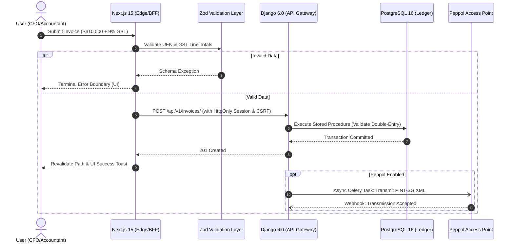
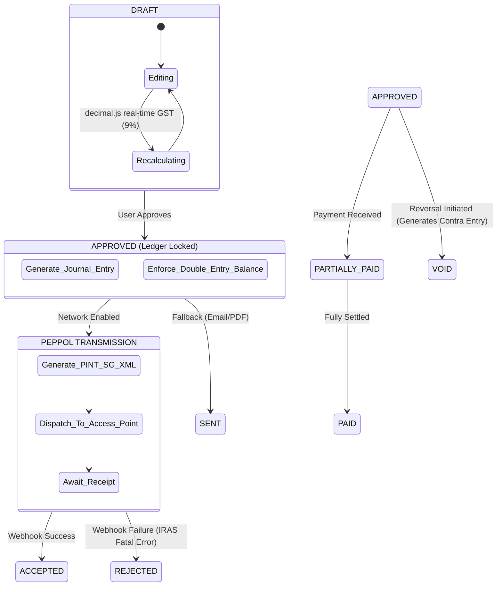

<div align="center">

# L E D G E R S G
**Enterprise-Grade Accounting for Singapore SMBs**

[](https://nextjs.org/)
[](https://www.djangoproject.com/)
[](https://www.postgresql.org/)
[](#)
[](#)

*Reject generic SaaS. Demand architectural precision.*

</div>

---

## Ⅰ. The Manifesto

**LedgerSG** is not a template. It is a highly opinionated, production-grade double-entry accounting platform purpose-built for the regulatory reality of **Singapore in February 2026**.

We reject the soft, generic aesthetics of modern web applications. Financial data requires authority, high contrast, and zero ambiguity. We employ a **"Neo-Brutalist Fintech"** design system: stark 1px architectural borders, tabular-aligned typography, and mathematically precise state management. 

Under the hood, we enforce absolute fiscal integrity. Every monetary value is bound to `DECIMAL(10,4)` precision from the PostgreSQL 16 core, through the Django 6.0 API, up to the Next.js 15 UI via `decimal.js`. There are no floating-point errors here.

---

## Ⅱ. System Architecture & Interaction

Our architecture enforces a strict Backend-for-Frontend (BFF) pattern. Next.js Server Actions manage the UI lifecycle, while the Django 6.0 core acts as the fortress for business logic, double-entry validation, and PostgreSQL communication.

### Actor & System Interaction


---

## Ⅲ. Application Logic Flow

Financial documents in LedgerSG follow an immutable state machine. Once a document is approved, the General Ledger is locked. Any subsequent alterations require a formal reversal (Void/Credit Note) to ensure strict auditability compliant with IRAS 5-year retention mandates.

### Invoice & Ledger State Machine


---

## Ⅳ. Annotated File Hierarchy

The frontend repository enforces strict separation between render cycles, global state, and data fetching. We mandate absolute Library Discipline: Shadcn/Radix primitives are styled via Tailwind CSS 4 variables, entirely rejecting custom CSS bloat.

```text
ledgersg-web/
├── src/
│   ├── app/                          # Next.js 15 App Router
│   │   ├── (auth)/login/page.tsx     # Terminal Authentication Gateway
│   │   ├── (dashboard)/              # Secure Application Shell
│   │   │   ├── invoices/page.tsx     # Advanced TanStack Data Grid
│   │   │   └── page.tsx              # Asymmetric Bento-Box Command Center
│   │   ├── actions/                  # Next.js Server Actions (Mutation handlers)
│   │   ├── globals.css               # Tailwind 4 @theme & Typography standards
│   │   └── layout.tsx                # Font injection & Noise Overlay
│   │
│   ├── components/                   # UI Library & Domain Components
│   │   ├── common/
│   │   │   ├── data-table.tsx        # Headless TanStack grid with geometric UI
│   │   │   └── brutalist-skeleton.tsx# Linear-wipe loading states
│   │   ├── invoicing/
│   │   │   ├── invoice-row.tsx       # Isolated render row (60fps performance)
│   │   │   └── tax-breakdown.tsx     # aria-live enabled real-time GST ticker
│   │   └── ui/                       # Strictly customized Shadcn primitives
│   │       ├── button.tsx            # 1px border, square corners, magnetic hover
│   │       └── toast.tsx             # Terminal-style alert notifications
│   │
│   ├── lib/
│   │   ├── api-client.ts             # Env-aware fetch (injects Django CSRF/Session)
│   │   └── validators/               # Zod schemas (Absolute Source of Truth)
│   │
│   └── store/
│       └── useInvoiceStore.ts        # Zustand state machine & decimal.js engine
│
├── tailwind.config.ts                # (Deprecated in v4, maintained for legacy plugins)
└── package.json                      # Strict dependency versions
```

---

## Ⅴ. Deployment Protocol

LedgerSG requires a split-deployment architecture. The frontend must be deployed to an Edge network for zero-latency BFF routing, while the backend requires a stateful, strictly isolated container environment.

### 1. Frontend (Next.js 15) -> Vercel
We utilize Vercel for the frontend to leverage Edge caching, Server-Sent Events, and optimized image/font delivery.

```bash
# 1. Install Vercel CLI
npm i -g vercel

# 2. Link repository & configure environment
vercel link
vercel env add NEXT_PUBLIC_API_URL # e.g., https://api.ledgersg.sg/api/v1

# 3. Deploy to production
vercel --prod
```

### 2. Backend (Django 6.0 + PostgreSQL 16) -> AWS / GCP (Docker)
The core ledger must run in a secure VPC. We provide a `docker-compose.prod.yml` that orchestrates the Django WSGI application, the PostgreSQL database, and the Celery workers required for async Peppol transmissions.

```yaml
# docker-compose.prod.yml (Abridged)
services:
  db:
    image: postgres:16-alpine
    environment:
      POSTGRES_DB: ledgersg_prod
    volumes:
      - pg_data:/var/lib/postgresql/data
      
  backend:
    build: ./ledgersg-api
    command: gunicorn config.wsgi:application --bind 0.0.0.0:8000
    environment:
      - DATABASE_URL=postgres://user:pass@db:5432/ledgersg_prod
      - CSRF_COOKIE_HTTPONLY=False
      - SECURE_HSTS_SECONDS=31536000
    depends_on:
      - db
      
  celery_worker:
    build: ./ledgersg-api
    command: celery -A config worker --loglevel=info
    # Required for async InvoiceNow (Peppol) PINT-SG transmissions
```

---

## Ⅵ. Development Setup

To initialize the development environment locally:

```bash
# 1. Clone the repository
git clone https://github.com/your-org/ledgersg.git

# 2. Initialize the Backend (Python 3.13)
cd ledgersg-api
python -m venv venv && source venv/bin/activate
pip install -r requirements.txt
python manage.py migrate
python manage.py runserver

# 3. Initialize the Frontend (Node 20+)
cd ../ledgersg-web
npm install
npm run dev
```
*Note: Ensure your local PostgreSQL instance is running and configured to accept `DECIMAL(10,4)` inserts without floating-point coercion.*

---
<div align="center">
  <p className="font-mono text-xs text-gray-500">
    Designed and Architected in Singapore • February 2026
  </p>
</div>
