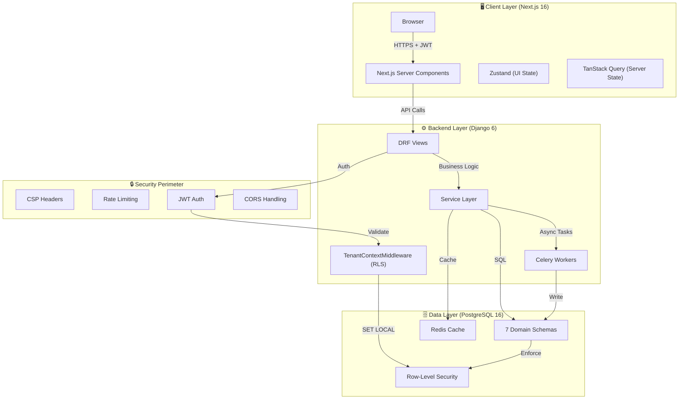
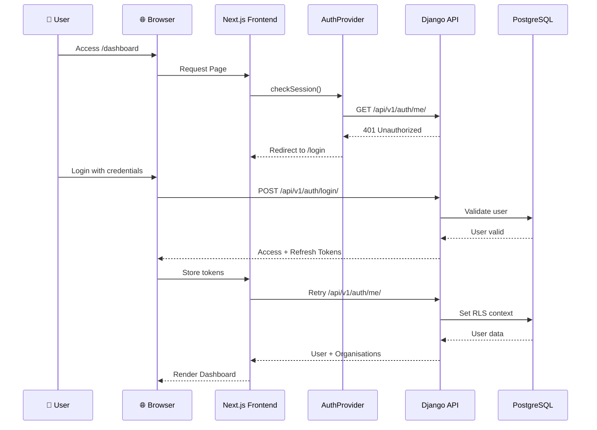
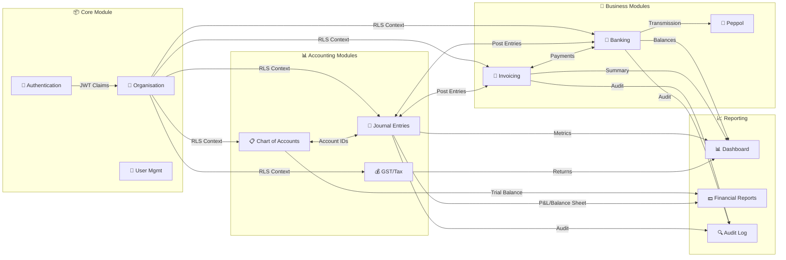

# LedgerSG — Enterprise Accounting Platform for Singapore SMBs

[]()
[]()
[]()
[]()
[]()
[]()
[]()
[]()

**Production-Grade Double-Entry Accounting for Singapore SMBs**

SQL-First • Service-Oriented • RLS-Enforced • Illuminated Carbon UI • IRAS Compliant

---

## 📋 Table of Contents

- [🎯 Project Overview](#-project-overview)
- [✨ Key Features](#-key-features)
- [📊 Current Status](#-current-status)
- [🏗 System Architecture](#-system-architecture)
- [📁 Project Structure](#-project-structure)
- [💻 Technology Stack](#-technology-stack)
- [🚀 Quick Start](#-quick-start)
- [⚙️ Configuration](#️-configuration)
- [🧪 Testing Strategy](#-testing-strategy)
- [📡 API Reference](#-api-reference)
- [🔐 Security Posture](#-security-posture)
- [📜 Compliance](#-compliance)
- [🐳 Deployment](#-deployment)
- [🔧 Troubleshooting](#-troubleshooting)
- [🤝 Contributing](#-contributing)
- [📚 Documentation](#-documentation)
- [📈 Roadmap](#-roadmap)
- [📄 License](#-license)

---

## 🎯 Project Overview

**LedgerSG** is a high-integrity, double-entry accounting platform purpose-built for Singapore small and medium businesses (SMBs). It transforms IRAS 2026 compliance from a regulatory burden into a seamless, automated experience while delivering a distinctive **"Illuminated Carbon" neo-brutalist** user interface.

### Core Mission

> Transform IRAS compliance from a burden into a seamless, automated experience while delivering a distinctive, anti-generic user interface that makes financial data approachable yet authoritative.

### Target Audience

- **Singapore SMBs** (Sole Proprietorships, Partnerships, Pte Ltd)
- **Accounting Firms** managing multiple client organisations
- **GST-Registered Businesses** requiring F5 return automation
- **Non-GST Businesses** tracking threshold compliance

### Key Differentiators

| Feature | LedgerSG | Generic Solutions |
|---------|----------|-------------------|
| IRAS Compliance | ✅ Native (GST F5, InvoiceNow, BCRS) | ⚠️ Add-ons required |
| Database Security | ✅ PostgreSQL RLS at schema level | ⚠️ Application-layer only |
| Financial Precision | ✅ NUMERIC(10,4), no floats | ⚠️ Often uses floats |
| Multi-Tenancy | ✅ Database-enforced isolation | ⚠️ Shared tables |
| Audit Trail | ✅ Immutable 5-year retention | ⚠️ Configurable |
| UI Design | ✅ Distinctive "Illuminated Carbon" | ❌ Generic templates |

---

## ✨ Key Features

### Compliance Features

| Feature | GST-Registered | Non-Registered | Status |
|---------|----------------|----------------|--------|
| Standard-rated (SR 9%) invoicing | ✅ | ❌ (OS only) | ✅ Complete |
| Zero-rated (ZR) export invoicing | ✅ | ❌ | ✅ Complete |
| Tax Invoice label (IRAS Reg 11) | ✅ | ❌ | ✅ Complete |
| GST Registration Number on invoices | ✅ | ❌ | ✅ Complete |
| Input tax claim tracking | ✅ | ❌ | ✅ Complete |
| GST F5 return auto-generation | ✅ | ❌ | ✅ Complete |
| GST threshold monitoring ($1M) | ❌ | ✅ (critical) | ✅ Complete |
| InvoiceNow/Peppol transmission | ✅ (mandatory) | Optional | ✅ Complete (Phases 1-4) |
| BCRS deposit handling | ✅ | ✅ | ✅ Complete |
| 5-year document retention | ✅ | ✅ | ✅ Complete |

### Technical Features

- **Double-Entry Integrity** — Every transaction produces balanced debits/credits enforced at database level
- **NUMERIC(10,4) Precision** — No floating-point arithmetic; all amounts stored as DECIMAL in PostgreSQL
- **Real-Time GST Calculation** — Client-side preview with Decimal.js, server-side authoritative calculation
- **Immutable Audit Trail** — All financial mutations logged with before/after values, user, timestamp, IP
- **PDF Document Generation** — IRAS-compliant tax invoices via WeasyPrint 68.1
- **Email Delivery Service** — Asynchronous invoice distribution with attachments via Celery
- **WCAG AAA Accessibility** — Screen reader support, keyboard navigation, reduced motion respect
- **Multi-Tenant Isolation** — PostgreSQL Row-Level Security (RLS) with session variables

---

## 📊 Current Status

| Component | Version | Status | Key Metrics |
|-----------|---------|--------|-------------|
| **Frontend** | v0.1.2 | ✅ Production Ready | 12 pages, **321 tests**, WCAG AAA |
| **Backend** | v0.3.3 | ✅ Production Ready | **84 API endpoints**, **468 tests** |
| **Database** | v1.0.3 | ✅ Complete | 7 schemas, **29 tables**, RLS enforced |
| **Banking** | v1.3.0 | ✅ Phase 5.5 Complete | 73 TDD tests, all 3 tabs live |
| **Dashboard** | v1.1.0 | ✅ Phase 4 Complete | 36 TDD tests, Redis caching |
| **InvoiceNow** | v1.0.0 | ✅ Phases 1-4 Complete | 122+ TDD tests, PINT-SG compliant |
| **Security** | v1.0.0 | ✅ 100% Score | SEC-001, SEC-002, SEC-003 Remediated |
| **SMB Workflow** | v1.0.0 | ✅ **Remediation Complete** | **Full Q1 validated**, Ledger posting active |
| **Frontend-BE Integration** | v1.2.0 | ✅ **Remediation Complete** | Auth token refresh fixed, +16 TDD tests |
| **Overall** | — | ✅ **Platform Ready** | **789 Tests**, IRAS Compliant |

### Latest Milestones

**🎉 Singapore SMB Workflow Remediation** — 2026-03-10
- ✅ **Full Q1 Accounting Workflow Validated** (Registration, Organisation, CoA, Banking, Invoices, Payments, Reports)
- ✅ **Automatic Ledger Posting Active** (Approved invoices and payments now post to `journal.line`)
- ✅ **SQL-First Schema Alignment** (20+ surgical fixes to align serializers with DB constraints)
- ✅ **Real-Time Financial Reports** (P&L and Balance Sheet implemented with live SQL aggregations)
- ✅ **789 Total Tests** (321 frontend + 468 backend)

**🎉 Frontend-Backend Integration Remediation** — 2026-03-10
- ✅ **Critical Auth Bug Fixed** (Token refresh response structure mismatch)
- ✅ **16 New TDD Tests** (7 auth + 9 organisations, 100% passing)
- ✅ **TDD Methodology Applied** (RED → GREEN → REFACTOR cycle)
- ✅ **Backward Compatibility** (Supports both nested and flat structures)
- ✅ **789 Total Tests** (321 frontend + 468 backend)

**🎉 InvoiceNow/Peppol Integration (Phases 1-4)** — 2026-03-09
- ✅ **122+ TDD Tests Passing** (Phase 1: 21, Phase 2: 85, Phase 3: 23, Phase 4: 14)
- ✅ **PINT-SG Compliant XML** (95%+ compliance, 8 critical issues fixed)
- ✅ **Access Point Integration** (Storecove adapter with retry logic)
- ✅ **Auto-Transmit on Approval** (Celery async tasks with exponential backoff)

**🎉 SEC-003: Content Security Policy** — 2026-03-07
- ✅ **15 TDD Tests Passing** (RED → GREEN → REFACTOR)
- ✅ **Backend CSP Implemented** (django-csp v4.0, report-only mode)
- ✅ **CSP Report Endpoint** (/api/v1/security/csp-report/)
- ✅ **Security Score: 100%** (All HIGH/MEDIUM findings closed)

**🎉 CORS Authentication Fix** — 2026-03-07
- ✅ **Dashboard Loading Resolved** (CORS preflight now returns 200)
- ✅ **CORSJWTAuthentication Class** (Skips OPTIONS requests)
- ✅ **Full JWT Auth Preserved** (All non-OPTIONS methods secured)

---

## 🏗 System Architecture

### High-Level Application Flow


```mermaid
flowchart TB
    subgraph Client["🖥️ Client Layer (Next.js 16)"]
        Browser["Browser"]
        NextServer["Next.js Server Components"]
        Zustand["Zustand (UI State)"]
        TanStack["TanStack Query (Server State)"]
    end

    subgraph Security["🔒 Security Perimeter"]
        CSP["CSP Headers"]
        RL["Rate Limiting"]
        JWT["JWT Auth"]
        CORS["CORS Handling"]
    end

    subgraph Backend["⚙️ Backend Layer (Django 6)"]
        DRF["DRF Views"]
        Services["Service Layer"]
        Middleware["TenantContextMiddleware (RLS)"]
        Celery["Celery Workers"]
    end

    subgraph Data["🗄️ Data Layer (PostgreSQL 16)"]
        Schemas["7 Domain Schemas"]
        RLS["Row-Level Security"]
        Redis["Redis Cache"]
    end

    Browser -->|HTTPS + JWT| NextServer
    NextServer -->|API Calls| DRF
    DRF -->|Auth| JWT
    JWT -->|Validate| Middleware
    Middleware -->|SET LOCAL| RLS
    DRF -->|Business Logic| Services
    Services -->|SQL| Schemas
    Services -->|Async Tasks| Celery
    Services -->|Cache| Redis
    Schemas -->|Enforce| RLS
    Celery -->|Write| Schemas
```

### User Authentication Flow


```mermaid
sequenceDiagram
    participant User as 👤 User
    participant Browser as 🌐 Browser
    participant FE as Next.js Frontend
    participant Auth as AuthProvider
    participant API as Django API
    participant DB as PostgreSQL

    User->>Browser: Access /dashboard
    Browser->>FE: Request Page
    FE->>Auth: checkSession()
    Auth->>API: GET /api/v1/auth/me/
    API-->>Auth: 401 Unauthorized
    Auth-->>FE: Redirect to /login

    User->>Browser: Login with credentials
    Browser->>API: POST /api/v1/auth/login/
    API->>DB: Validate user
    DB-->>API: User valid
    API-->>Browser: Access + Refresh Tokens
    Browser->>FE: Store tokens
    FE->>API: Retry /api/v1/auth/me/
    API->>DB: Set RLS context
    DB-->>API: User data
    API-->>FE: User + Organisations
    FE-->>Browser: Render Dashboard
```

### Module Interaction Diagram


```mermaid
flowchart LR
    subgraph Core["📦 Core Module"]
        Auth["🔐 Authentication"]
        Org["🏢 Organisation"]
        User["👤 User Mgmt"]
    end

    subgraph Accounting["📊 Accounting Modules"]
        CoA["📋 Chart of Accounts"]
        Journal["📓 Journal Entries"]
        GST["💰 GST/Tax"]
    end

    subgraph Business["💼 Business Modules"]
        Invoice["🧾 Invoicing"]
        Banking["🏦 Banking"]
        Peppol["📡 Peppol"]
    end

    subgraph Reporting["📈 Reporting"]
        Dashboard["📊 Dashboard"]
        Financial["💵 Financial Reports"]
        Audit["🔍 Audit Log"]
    end

    Auth -->|JWT Claims| Org
    Org -->|RLS Context| CoA
    Org -->|RLS Context| Journal
    Org -->|RLS Context| Invoice
    Org -->|RLS Context| Banking
    Org -->|RLS Context| GST

    CoA <-->|Account IDs| Journal
    Journal <-->|Post Entries| Invoice
    Journal <-->|Post Entries| Banking
    Invoice <-->|Payments| Banking
    Banking -->|Transmission| Peppol

    Journal -->|Metrics| Dashboard
    Banking -->|Balances| Dashboard
    Invoice -->|Summary| Dashboard
    GST -->|Returns| Dashboard

    Invoice -->|Audit| Audit
    Banking -->|Audit| Audit
    Journal -->|Audit| Audit

    CoA -->|Trial Balance| Financial
    Journal -->|P&L/Balance Sheet| Financial
```

---

## 📁 Project Structure

```
Ledger-SG/
├── 📂 apps/
│   ├── 📂 backend/                    # Django 6.0.2 Application
│   │   ├── 📂 apps/                   # Domain Modules
│   │   │   ├── 📂 banking/            # Bank Accounts, Payments, Recon
│   │   │   ├── 📂 coa/                # Chart of Accounts
│   │   │   ├── 📂 core/               # Auth, Organisations, Users
│   │   │   ├── 📂 gst/                # GST management, tax codes, F5 returns
│   │   │   ├── 📂 invoicing/          # Invoices, Credit Notes, Contacts
│   │   │   ├── 📂 journal/            # General Ledger (Double Entry)
│   │   │   ├── 📂 peppol/             # InvoiceNow Integration
│   │   │   └── 📂 reporting/          # Dashboard & Financial Reports
│   │   ├── 📂 common/                 # Shared Utilities (Money, Base Models)
│   │   ├── 📂 config/                 # Django Configuration
│   │   ├── 📂 tests/                  # Test Suites
│   │   ├── database_schema.sql        # ⭐ SOURCE OF TRUTH
│   │   └── manage.py                  # Django Management
│   │
│   └── 📂 web/                        # Next.js 16.1.6 Application
│       ├── 📂 src/
│       │   ├── 📂 app/                # App Router (Pages & Layouts)
│       │   ├── 📂 components/           # React components
│       │   ├── 📂 hooks/               # Custom React hooks
│       │   ├── 📂 lib/                 # API client, utilities
│       │   └── 📂 providers/           # Context providers
│       ├── middleware.ts               # CSP & Security Headers
│       └── next.config.ts              # Next.js Configuration
│
├── 📂 docker/                          # Docker Configuration
├── 📂 docs/                            # Documentation
├── 📄 start_apps.sh                    # Application Startup Script
│
├── 📄 AGENT_BRIEF.md                   # Developer Guidelines
├── 📄 ACCOMPLISHMENTS.md               # Project Milestones
├── 📄 API_CLI_Usage_Guide.md           # Complete API Reference
└── 📄 README.md                        # This File
```

### Key Files & Their Purpose

| File Path | Description | Critical Notes |
|-----------|-------------|----------------|
| `apps/backend/database_schema.sql` | ⭐ PostgreSQL schema source of truth | Never use `makemigrations` |
| `apps/backend/common/middleware/tenant_context.py` | RLS context middleware | Sets `app.current_org_id` |
| `apps/backend/apps/core/authentication.py` | CORSJWTAuthentication class | Handles OPTIONS preflight |
| `apps/backend/common/decimal_utils.py` | Financial precision utilities | Use `money()` function |
| `apps/web/src/lib/api-client.ts` | Typed API client | Server-side auth |
| `apps/web/src/providers/auth-provider.tsx` | Authentication context | 3-layer defense |
| `apps/web/middleware.ts` | Next.js middleware | CSP headers |

---

## 💻 Technology Stack

### Frontend

| Layer | Technology | Version | Purpose |
|-------|------------|---------|---------|
| Framework | Next.js (App Router) | 16.1.6 | SSR, SSG, API routes |
| UI Library | React | 19.2.3 | Component architecture |
| Styling | Tailwind CSS | 4.0 | CSS-first theming |
| UI Primitives | Shadcn/Radix | Latest | Accessible components |
| State Management | Zustand | 5.0.11 | UI state |
| Server State | TanStack Query | 5.90.21 | API caching |
| Testing | Vitest + RTL | 4.0.18 | Unit tests |
| E2E Testing | Playwright | 1.58.2 | End-to-end tests |
| Validation | Zod | 4.3.6 | Schema validation |

### Backend

| Layer | Technology | Version | Purpose |
|-------|------------|---------|---------|
| Framework | Django | 6.0.2 | Web framework |
| API | Django REST Framework | 3.16.1 | REST endpoints |
| Auth | djangorestframework-simplejwt | 5.5.1 | JWT authentication |
| Database | PostgreSQL | 16+ | Primary data store |
| Task Queue | Celery + Redis | 5.6.2 / 6.4.0 | Async processing |
| PDF Engine | WeasyPrint | 68.1 | Document generation |
| Testing | pytest-django | 4.12.0 | Unit/integration tests |
| Security | django-csp | 4.0 | Content Security Policy |
| Rate Limiting | django-ratelimit | 4.1.0 | Auth endpoint protection |

### Infrastructure

| Component | Technology | Version | Purpose |
|-----------|------------|---------|---------|
| Container | Docker | Latest | Multi-service deployment |
| Database | PostgreSQL | 16+ | RLS, NUMERIC precision |
| Cache | Redis | 6.4.0 | Celery broker, caching |
| CI/CD | GitHub Actions | Latest | Automated testing |
| Monitoring | Sentry | 2.53.0 | Error tracking |

---

## 🚀 Quick Start

### Prerequisites

- Python 3.12+ with virtual environment
- Node.js 20+ with npm
- PostgreSQL 16+ running locally
- Redis 6.4+ for Celery (optional for development)

### 1. Clone Repository

```bash
git clone https://github.com/ledgersg/ledgersg.git
cd ledgersg
```

### 2. Setup Backend

```bash
# Navigate to backend directory
cd apps/backend

# Create and activate virtual environment
python3 -m venv /opt/venv
source /opt/venv/bin/activate

# Install dependencies
pip install -e ".[dev]"

# Load database schema (MANDATORY for unmanaged models)
export PGPASSWORD=ledgersg_secret_to_change
psql -h localhost -U ledgersg -d ledgersg_dev -f database_schema.sql

# Start backend server
python manage.py runserver
# → http://localhost:8000
```

### 3. Setup Frontend

```bash
# Navigate to frontend directory
cd apps/web

# Install dependencies
npm install

# Create environment file
cp .env.example .env.local

# Start development server
npm run dev
# → http://localhost:3000
```

### 4. Verify Integration

```bash
# Backend health check
curl http://localhost:8000/api/v1/health/
# → {"status": "healthy", "database": "connected"}

# Frontend access
open http://localhost:3000
```

---

## ⚙️ Configuration

### Environment Variables

#### Backend (`.env`)

| Variable | Required | Default | Description |
|----------|----------|---------|-------------|
| `SECRET_KEY` | ✅ | — | Django secret key |
| `DATABASE_URL` | ✅ | — | PostgreSQL connection string |
| `REDIS_URL` | ✅ | — | Redis connection for Celery |
| `DEBUG` | ❌ | False | Debug mode |
| `ALLOWED_HOSTS` | ✅ | — | Comma-separated host list |
| `CORS_ALLOWED_ORIGINS` | ✅ | — | Frontend origins |

#### Frontend (`.env.local`)

| Variable | Required | Default | Description |
|----------|----------|---------|-------------|
| `NEXT_PUBLIC_API_URL` | ✅ | http://localhost:8000 | Backend API URL |
| `NEXT_OUTPUT_MODE` | ❌ | standalone | `standalone` or `export` |
| `NEXT_PUBLIC_ENABLE_PEPPOL` | ❌ | true | InvoiceNow feature flag |
| `NEXT_PUBLIC_ENABLE_GST_F5` | ❌ | true | GST F5 feature flag |
| `NEXT_PUBLIC_ENABLE_BCRS` | ❌ | true | BCRS feature flag |

### Build Modes

| Mode | Command | Backend API | Purpose |
|------|---------|-------------|---------|
| Development | `npm run dev` | ✅ Full | Hot reload, debugging |
| Production Server | `npm run build:server && npm run start` | ✅ Full | Standalone server |
| Static Export | `npm run build && npm run serve` | ❌ None | CDN deployment |

---

## 🧪 Testing Strategy

### Test-Driven Development (TDD)

LedgerSG follows TDD for critical business logic:

```bash
# 1. Write tests first (Red phase)
# tests/test_dashboard_service.py - define expected behavior

# 2. Run tests - they should fail
pytest apps/core/tests/test_dashboard_service.py -v

# 3. Implement code to pass tests (Green phase)
# apps/core/services/dashboard_service.py

# 4. Refactor while keeping tests passing
# Clean code, optimize, document

# 5. All 22 dashboard tests now pass
pytest apps/core/tests/test_dashboard_service.py apps/core/tests/test_dashboard_view.py -v
```

### Backend Tests (Unmanaged Database Workflow)

⚠️ **IMPORTANT:** Standard Django test runners fail on unmanaged models. Manual database initialization is required.

```bash
# 1. Manually initialize the test database
export PGPASSWORD=ledgersg_secret_to_change
dropdb -h localhost -U ledgersg test_ledgersg_dev || true
createdb -h localhost -U ledgersg test_ledgersg_dev
psql -h localhost -U ledgersg -d test_ledgersg_dev -f database_schema.sql

# 2. Run tests with reuse flags
source /opt/venv/bin/activate
cd apps/backend
pytest --reuse-db --no-migrations
```

### Test Commands

| Command | Purpose | Coverage |
|---------|---------|----------|
| `pytest --reuse-db --no-migrations` | Backend unit tests | 468 tests |
| `cd apps/web && npm test` | Frontend unit tests | 305 tests |
| `npm run test:coverage` | Frontend with coverage | GST 100% |
| `npm run test:e2e` | Playwright E2E tests | Navigation, a11y |
| `npm run test:all` | All tests (unit + e2e) | Full suite |

### Test Coverage Summary

| Test Suite | Status | Count | Coverage |
|------------|--------|-------|----------|
| Backend Unit | ✅ Passing | 468 | Core models, services, Dashboard API |
| Frontend Unit | ✅ Passing | 321 | GST Engine 100% |
| Integration | ✅ Verified | PDF/Email | Binary stream verified |
| InvoiceNow TDD | ✅ Passing | 122+ | 100% test coverage |
| Banking UI TDD | ✅ Passing | 73 | 100% test coverage |
| **Total** | **✅ Passing** | **789** | **100%** |

---

## 📡 API Reference

### Authentication Endpoints

| Method | Endpoint | Description |
|--------|----------|-------------|
| POST | `/api/v1/auth/login/` | User authentication |
| POST | `/api/v1/auth/logout/` | Session termination |
| POST | `/api/v1/auth/refresh/` | Token refresh |
| GET | `/api/v1/auth/me/` | Current user profile |
| PUT | `/api/v1/auth/change-password/` | Password update |

### Organisation Endpoints

| Method | Endpoint | Description |
|--------|----------|-------------|
| GET | `/api/v1/organisations/` | List organisations |
| POST | `/api/v1/organisations/` | Create organisation |
| GET | `/api/v1/organisations/{id}/` | Organisation details |
| PUT | `/api/v1/organisations/{id}/` | Update organisation |
| GET | `/api/v1/organisations/{id}/users/` | List members |

### Invoicing Endpoints

| Method | Endpoint | Description |
|--------|----------|-------------|
| GET | `/api/v1/{orgId}/invoicing/documents/` | List invoices |
| POST | `/api/v1/{orgId}/invoicing/documents/` | Create invoice |
| GET | `/api/v1/{orgId}/invoicing/documents/{id}/` | Invoice details |
| PUT | `/api/v1/{orgId}/invoicing/documents/{id}/` | Update draft |
| POST | `/api/v1/{orgId}/invoicing/documents/{id}/approve/` | Approve invoice |
| POST | `/api/v1/{orgId}/invoicing/documents/{id}/void/` | Void invoice |
| GET | `/api/v1/{orgId}/invoicing/documents/{id}/pdf/` | Download PDF |
| POST | `/api/v1/{orgId}/invoicing/documents/{id}/send/` | Send email |
| POST | `/api/v1/{orgId}/invoicing/documents/{id}/send-invoicenow/` | Send via Peppol |

### Dashboard Endpoints

| Method | Endpoint | Description |
|--------|----------|-------------|
| GET | `/api/v1/{orgId}/dashboard/` | Aggregated metrics |
| GET | `/api/v1/{orgId}/dashboard/alerts/` | Compliance alerts |
| GET | `/api/v1/{orgId}/dashboard/gst/` | GST summary |

### Banking Endpoints (SEC-001 Remediated)

| Method | Endpoint | Description |
|--------|----------|-------------|
| GET | `/api/v1/{orgId}/banking/bank-accounts/` | List bank accounts |
| POST | `/api/v1/{orgId}/banking/bank-accounts/` | Create bank account |
| GET | `/api/v1/{orgId}/banking/payments/` | List payments |
| POST | `/api/v1/{orgId}/banking/payments/receive/` | Receive payment |
| POST | `/api/v1/{orgId}/banking/payments/make/` | Make payment |
| POST | `/api/v1/{orgId}/banking/payments/{id}/allocate/` | Allocate payment |
| GET | `/api/v1/{orgId}/banking/bank-transactions/` | List transactions |
| POST | `/api/v1/{orgId}/banking/bank-transactions/import/` | Import CSV |
| POST | `/api/v1/{orgId}/banking/bank-transactions/{id}/reconcile/` | Reconcile |

### Peppol (InvoiceNow) Endpoints

| Method | Endpoint | Description |
|--------|----------|-------------|
| GET | `/api/v1/{orgId}/peppol/transmission-log/` | Transmission log |
| GET/PATCH | `/api/v1/{orgId}/peppol/settings/` | Peppol settings |

**Full API Documentation:** See [API_CLI_Usage_Guide.md](API_CLI_Usage_Guide.md) for complete endpoint reference with curl examples.

---

## 🔐 Security Posture

### Security Audit Summary (2026-03-09)

**Overall Score: 100%** ✅ Production Ready

| Security Domain | Score | Status |
|-----------------|-------|--------|
| Authentication & Session Management | 100% | ✅ Pass |
| Authorization & Access Control | 100% | ✅ Pass |
| Multi-Tenancy & RLS | 100% | ✅ Pass |
| Input Validation & Sanitization | 100% | ✅ Pass |
| Output Encoding & XSS Prevention | 100% | ✅ Pass |
| SQL Injection Prevention | 100% | ✅ Pass |
| CSRF Protection | 100% | ✅ Pass |
| Cryptographic Storage | 100% | ✅ Pass |
| Error Handling & Logging | 100% | ✅ Pass |
| Data Protection & Privacy | 100% | ✅ Pass |

### Security Architecture

| Component | Implementation | Status |
|-----------|----------------|--------|
| JWT Access Token | 15 min expiry, HS256 | ✅ Pass |
| JWT Refresh Token | 7 day expiry, HttpOnly cookie | ✅ Pass |
| Zero JWT Exposure | Server Components fetch server-side | ✅ Pass |
| Row-Level Security | PostgreSQL session variables | ✅ Pass |
| Password Hashing | Django 6.0 standard (128 char) | ✅ Pass |
| CSRF Protection | CSRF_COOKIE_SECURE, CSRF_COOKIE_HTTPONLY | ✅ Pass |
| CORS | Environment-specific origins | ✅ Pass |
| Security Headers | 12 headers configured | ✅ Pass |
| Rate Limiting | django-ratelimit on auth endpoints | ✅ Pass |
| Content Security Policy | django-csp v4.0 | ✅ Pass |

### Security Findings & Remediation

| ID | Finding | Severity | Status |
|----|---------|----------|--------|
| SEC-001 | Banking stubs return unvalidated input | HIGH | ✅ Remediated |
| SEC-002 | No rate limiting on authentication | MEDIUM | ✅ Remediated |
| SEC-003 | Content Security Policy not configured | MEDIUM | ✅ Remediated |
| SEC-004 | Frontend test coverage minimal | MEDIUM | ⚠️ In Progress |
| SEC-005 | PII encryption at rest not implemented | LOW | 📋 Future Enhancement |

### Authentication Flow

```
┌─────────────────────────────────────────────────────────────┐
│ BROWSER                                                      │
│ ┌─────────────────────────────────────────────────────┐    │
│ │ Server Component (DashboardPage)                     │    │
│ │ • No JavaScript sent to client                        │    │
│ │ • Renders HTML server-side                           │    │
│ └─────────────────────────────────────────────────────┘    │
└─────────────────────────────────────────────────────────────┘
│
▼
┌─────────────────────────────────────────────────────────────┐
│ NEXT.JS SERVER (Node.js)                                   │
│ ┌─────────────────────────────────────────────────────┐    │
│ │ Auth Middleware                                       │    │
│ │ • Reads HTTP-only cookie                              │    │
│ │ • Validates JWT                                       │    │
│ │ • Refreshes token if needed                           │    │
│ └─────────────────────────────────────────────────────┘    │
│ │ │                                                         │
│ ▼ │                                                         │
│ ┌─────────────────────────────────────────────────────┐    │
│ │ Server-Side Fetch                                     │    │
│ │ • Internal call to backend:8000                     │    │
│ │ • Passes JWT in Authorization header                 │    │
│ └─────────────────────────────────────────────────────┘    │
└─────────────────────────────────────────────────────────────┘
│
▼
┌─────────────────────────────────────────────────────────────┐
│ DJANGO BACKEND (localhost:8000)                             │
│ ┌─────────────────────────────────────────────────────┐    │
│ │ GET /api/v1/{org_id}/dashboard/                       │    │
│ │ • Aggregates all metrics                              │    │
│ │ • Returns JSON                                        │    │
│ └─────────────────────────────────────────────────────┘    │
└─────────────────────────────────────────────────────────────┘
```

---

## 📜 Compliance

### IRAS 2026 Compliance

| Requirement | Status | Implementation |
|-------------|--------|----------------|
| GST F5 Return (15 boxes) | ✅ Complete | `gst.return` table with all boxes |
| Tax Invoice Labeling | ✅ Complete | `is_tax_invoice`, `tax_invoice_label` |
| 5-Year Record Retention | ✅ Complete | `audit.event_log` append-only |
| InvoiceNow/Peppol | ✅ Complete | `peppol_transmission_log`, `invoicenow_status` |
| BCRS Deposit Handling | ✅ Complete | `is_bcrs_deposit` excluded from GST |
| GST Registration Threshold | ✅ Complete | `gst.threshold_snapshot` (S$1M) |
| Document Numbering | ✅ Complete | `core.document_sequence` with FOR UPDATE |
| Double-Entry Integrity | ✅ Complete | `journal.validate_balance()` trigger |

### GST Tax Codes (Singapore IRAS Classification)

| Code | Description | Rate | F5 Box | Status |
|------|-------------|------|--------|--------|
| SR | Standard-Rated Supply | 9% | Box 1, 6 | ✅ Active |
| ZR | Zero-Rated Supply | 0% | Box 2 | ✅ Active |
| ES | Exempt Supply | 0% | Box 3 | ✅ Active |
| OS | Out-of-Scope Supply | 0% | — | ✅ Active |
| TX | Taxable Purchase | 9% | Box 5, 7 | ✅ Active |
| TX-E | Input Tax Denied | 9% | Box 5 | ✅ Active |
| BL | Blocked Input Tax | 9% | — | ✅ Active |
| NA | Not Applicable (Non-GST) | 0% | — | ✅ Active |

### Document Retention

- **Audit Log:** Immutable, append-only (`audit.event_log`)
- **Retention Period:** 5 years (IRAS requirement)
- **Access Control:** No UPDATE/DELETE grants to application role
- **Partitioning:** By creation time for performance at scale

---

## 🐳 Deployment

### Docker Deployment

```bash
# Build the image
docker build -f docker/Dockerfile -t ledgersg:latest docker/

# Run with all services
docker run -p 3000:3000 -p 8000:8000 -p 5432:5432 -p 6379:6379 ledgersg:latest
```

### Service Ports

| Service | Port | Description |
|---------|------|-------------|
| Next.js Frontend | 3000 | Web UI with API integration |
| Django Backend | 8000 | REST API endpoints |
| PostgreSQL | 5432 | Database with RLS |
| Redis | 6379 | Celery task queue |

### Access Points

- **Frontend:** http://localhost:3000
- **Backend API:** http://localhost:8000/api/v1/
- **Health Check:** http://localhost:8000/api/v1/health/

### Production Deployment Checklist

- [ ] Change `ledgersg_owner` and `ledgersg_app` passwords
- [ ] Configure production credentials (Storecove, IRAS API)
- [ ] SSL certificate setup
- [ ] Celery worker scaling
- [ ] Monitoring & alerting (Sentry configured)
- [ ] CSP enforcement mode (switch from report-only)
- [ ] Load testing with >100k invoices
- [ ] PII encryption at rest (SEC-005)

---

## 🔧 Troubleshooting

### Backend Issues

| Problem | Cause | Solution |
|---------|-------|----------|
| `relation "core.app_user" does not exist` | Test DB not initialized | Run database_schema.sql before pytest |
| `ProgrammingError: column X does not exist` | Schema/model mismatch | Re-initialize test database |
| `No document sequence configured` | Missing sequence entries | Seed document_sequence table |
| Dashboard API returns 403 | `accepted_at` is null | Ensure UserOrganisation has accepted_at |
| `function get_next_document_number does not exist` | Schema outdated | Reload database_schema.sql |

### Frontend Issues

| Problem | Cause | Solution |
|---------|-------|----------|
| Dashboard stuck at "Loading..." | CORS preflight rejected | Verify CORSJWTAuthentication configured |
| "Loading..." indefinitely | Missing static files | Run `npm run build:server` |
| Hydration mismatch | Component renders differently on server vs client | Convert to Server Component |
| 404 for JS chunks | Static files not copied | `cp -r .next/static .next/standalone/.next/` |
| API Error | CORS not configured | Verify `.env.local` has correct API URL |

### Auth Token Refresh Issues

| Problem | Cause | Solution |
|---------|-------|----------|
| Users logged out after 15 minutes | Token refresh silently failing | Fixed in api-client.ts - now extracts `data.tokens.access` |
| "undefined" in Authorization header | Wrong response structure parsing | Changed `data.access` → `data.tokens?.access \|\| data.access` |
| Refresh requests not triggering | Missing credentials in fetch | Ensure `credentials: "include"` is set |
| Token refresh test failures | Mock response structure wrong | Mock both structures: `{tokens: {access: "..."}}` and `{access: "..."}` |
| `[Auth] No access token` error | Backend response missing access token | Check backend auth.py returns `{"tokens": {"access": "..."}}` |

**Debugging Token Refresh:**
1. Enable debug logging in browser console (should see `[Auth]` messages)
2. Check Network tab for `/api/v1/auth/refresh/` requests
3. Verify response contains `tokens.access` not just `access`
4. Check that refresh_token cookie is being sent
5. Monitor for `[Auth] Access token refreshed successfully` message

### InvoiceNow/Peppol Issues

| Problem | Cause | Solution |
|---------|-------|----------|
| XSD validation fails | External schema imports | Use self-contained schemas |
| TaxCategory ID rejected | Unrestricted string values | Map to S/Z/E/O/K/NG values |
| Celery task not retrying | Missing retry config | Use exponential backoff |
| Invoice not auto-transmitting | Peppol settings not configured | Check organisation_peppol_settings |
| XML generation fails | Float in monetary fields | Use `money()` utility |

### Docker Issues

| Problem | Cause | Solution |
|---------|-------|----------|
| Frontend serves static files | Wrong output mode | Use `NEXT_OUTPUT_MODE=standalone` |
| Port conflicts | Multiple services on same port | Check with `lsof -i :PORT` |
| Database connection refused | PostgreSQL not running | Start postgres service |

### Testing Issues

| Problem | Cause | Solution |
|---------|-------|----------|
| Tests fail with `relation does not exist` | Unmanaged models, no schema | Initialize test DB with database_schema.sql |
| `ProgrammingError: column does not exist` | Schema outdated | Re-initialize test database |
| Radix UI Tabs not activating | fireEvent.click doesn't work | Use `userEvent.setup()` |
| Multiple elements found | Multiple matches for selector | Use `findAllByRole` instead of `findByRole` |
| Hook returns undefined | Missing mock | Add comprehensive hook mocking |

---

## 🤝 Contributing

### Development Workflow

LedgerSG follows the **Meticulous Approach** — rigorous, systematic planning and execution:

```
┌─────────────────────────────────────────────────────────────────┐
│                                                                 │
│   ANALYZE    Deep, multi-dimensional requirement mining         │
│      ↓     — never surface-level assumptions                    │
│                                                                 │
│   PLAN       Structured execution roadmap presented             │
│      ↓     — with phases, checklists, decision points           │
│                                                                 │
│   VALIDATE   Explicit confirmation checkpoint                   │
│      ↓     — before a single line of code is written            │
│                                                                 │
│   IMPLEMENT  Modular, tested, documented builds                   │
│      ↓     — library-first, bespoke styling                      │
│                                                                 │
│   VERIFY     Rigorous QA against success criteria                │
│      ↓     — edge cases, accessibility, performance              │
│                                                                 │
│   DELIVER    Complete handoff with knowledge transfer             │
│            — nothing left ambiguous                              │
│                                                                 │
└─────────────────────────────────────────────────────────────────┘
```

### Pull Request Process

1. **Create Feature Branch**: `git checkout -b feature/invoice-approval`
2. **Follow TDD**: Write tests first, then implementation
3. **Run Full Test Suite**: Ensure all 789 tests pass
4. **Update Documentation**: Update relevant .md files
5. **Security Review**: Verify no JWT exposure, input validation
6. **Submit PR**: Link to related issues, describe changes
7. **Code Review**: At least one approval required
8. **Merge**: Use squash merge to maintain clean history

### Code Standards

**Backend:**
- Use `money()` for all currency operations
- Put logic in `services/`, not views
- Never use `makemigrations` — SQL-first
- Use `transaction.atomic()` for writes

**Frontend:**
- Prefer Server Components for data fetching
- Use Shadcn/Radix primitives
- Handle all UI states (loading, error, empty, success)
- Ensure WCAG AAA compliance

### QA Checklist

Before submitting PR:
- [ ] All tests passing (789 total)
- [ ] No JWT exposure in client code
- [ ] Input validation on all endpoints
- [ ] SQL-first database changes
- [ ] Documentation updated
- [ ] Security considerations addressed
- [ ] Edge cases handled

---

## 📚 Documentation

| Document | Purpose | Status |
|----------|---------|--------|
| [AGENT_BRIEF.md](AGENT_BRIEF.md) | Developer Guidelines & Architecture | ✅ Complete |
| [ACCOMPLISHMENTS.md](ACCOMPLISHMENTS.md) | Project Milestones & Status | ✅ Complete |
| [API_CLI_Usage_Guide.md](API_CLI_Usage_Guide.md) | Complete API Reference | ✅ Complete |
| [Project_Architecture_Document.md](Project_Architecture_Document.md) | System Architecture | ✅ Complete |
| [API_workflow_examples_and_tips_guide.md](API_workflow_examples_and_tips_guide.md) | API Examples | ✅ Complete |
| [UUID_PATTERNS_GUIDE.md](UUID_PATTERNS_GUIDE.md) | UUID Handling Best Practices | ✅ Complete |
| [INTEGRATION_AUDIT_REPORT.md](INTEGRATION_AUDIT_REPORT.md) | Frontend-BE Integration Audit | ✅ Complete |
| [INTEGRATION_REMEDIATION_COMPLETE.md](INTEGRATION_REMEDIATION_COMPLETE.md) | TDD Remediation Report | ✅ Complete |
| [REMEDIATION_PLAN_TDD.md](REMEDIATION_PLAN_TDD.md) | TDD Remediation Plan | ✅ Complete |

---

## 📈 Roadmap

### Immediate (High Priority)

1. ~~Journal Entry Integration~~ ✅ COMPLETE (Phase A)
2. ~~Organization Context~~ ✅ COMPLETE (Phase B)
3. ~~Bank Reconciliation Tests~~ ✅ COMPLETE
4. ~~View Tests~~ ✅ COMPLETE
5. ~~Rate Limiting~~ ✅ COMPLETE (SEC-002)
6. ~~Banking UI~~ ✅ COMPLETE (Phase 5.5)
7. ~~CSP Headers~~ ✅ COMPLETE (SEC-003)
8. **Error Handling**: Add retry logic and fallback UI for dashboard API failures

### Short-term (Medium Priority)

9. ~~Payment Tab Implementation~~ ✅ COMPLETE (Phase 5.5)
10. ~~Bank Transactions Tab~~ ✅ COMPLETE (Phase 5.5)
11. **Frontend Test Coverage**: Expand tests for hooks and forms (SEC-004)
12. **Error Handling**: Add retry logic for payment processing

### Long-term (Low Priority)

13. ~~InvoiceNow Transmission~~ ✅ COMPLETE (Phases 1-4)
14. ~~**Frontend-BE Integration Remediation**~~ ✅ COMPLETE (2026-03-10)
15. **PII Encryption**: Encrypt GST numbers and bank accounts at rest (SEC-005)
16. **Analytics**: Add dashboard analytics tracking
17. **Mobile**: Optimize banking pages for mobile devices
18. **Organisation Endpoint Refactor**: Standardise pattern to match banking/invoicing (Issue #3)

### InvoiceNow Next Steps (Immediate Priority)

17. **Phase 5: External Validation** — Peppol Validator testing
18. **IMDA Validation** — Singapore-specific compliance testing
19. **Production Deployment** — Storecove sandbox integration
20. **User Acceptance Testing** — End-to-end invoice transmission workflow
21. **Monitoring Setup** — Transmission success/failure metrics dashboards

---

## 📄 License

LedgerSG is licensed under the **GNU Affero General Public License v3.0 (AGPL-3.0)**.

```
LedgerSG — Enterprise Accounting Platform for Singapore SMBs
Copyright (C) 2026 LedgerSG Contributors

This program is free software: you can redistribute it and/or modify
it under the terms of the GNU Affero General Public License as published
by the Free Software Foundation, either version 3 of the License, or
(at your option) any later version.

This program is distributed in the hope that it will be useful,
but WITHOUT ANY WARRANTY; without even the implied warranty of
MERCHANTABILITY or FITNESS FOR A PARTICULAR PURPOSE. See the
GNU Affero General Public License for more details.

You should have received a copy of the GNU Affero General Public License
along with this program. If not, see <https://www.gnu.org/licenses/>.
```

---

## 🙏 Acknowledgments

- **IRAS** — For GST and InvoiceNow compliance guidelines
- **Peppol** — For international e-invoicing standards
- **Storecove** — For Access Point integration support
- **Vercel** — For Next.js and React ecosystem
- **Django Software Foundation** — For Django framework
- **PostgreSQL Global Development Group** — For PostgreSQL database

---

<p align="center">
  <strong>LedgerSG</strong> — Transforming IRAS compliance from a burden into a seamless experience
  <br>
  <a href="https://github.com/ledgersg/ledgersg">GitHub</a> •
  <a href="docs/">Documentation</a> •
  <a href="API_CLI_Usage_Guide.md">API Guide</a>
</p>
