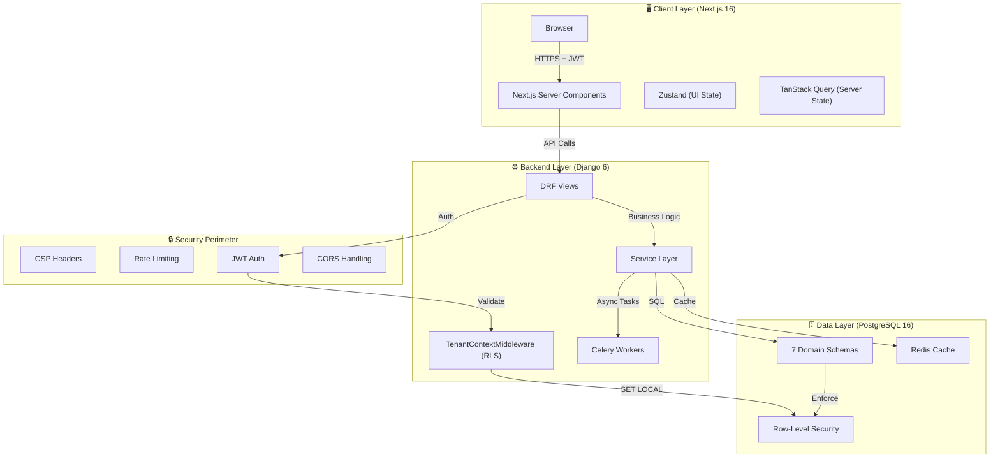
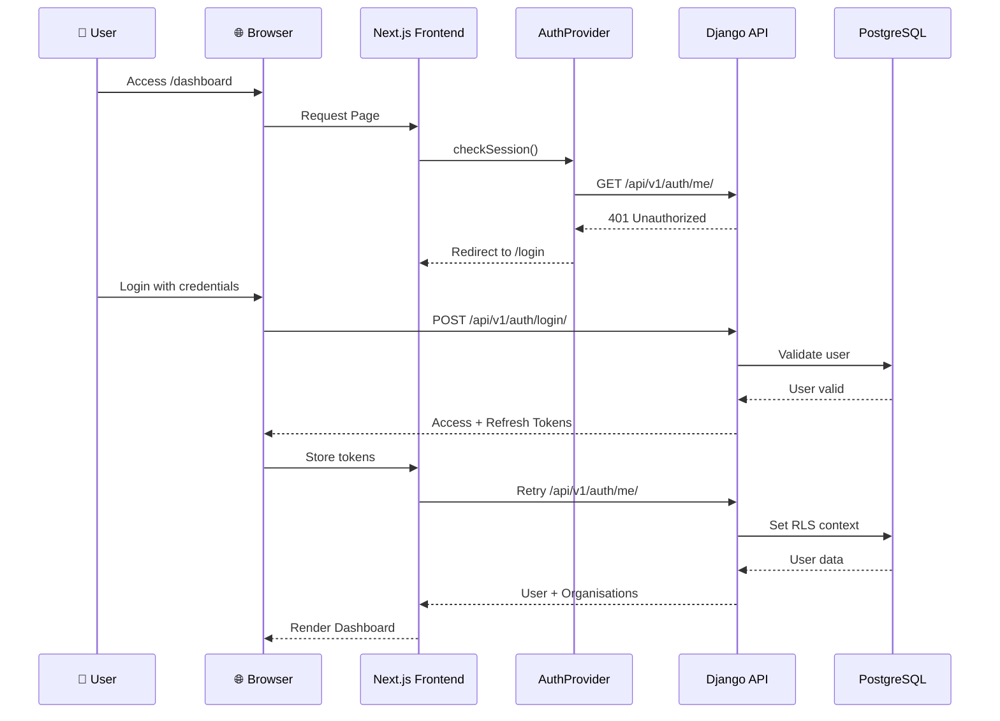
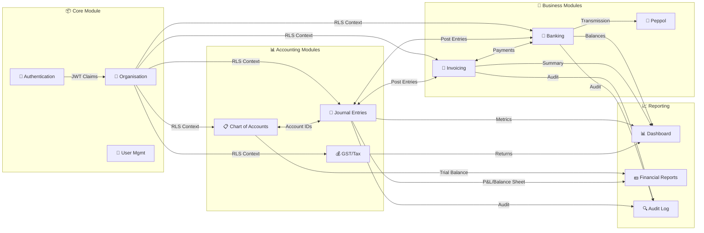

# LedgerSG — Enterprise Accounting Platform for Singapore SMBs

[](https://iras.gov.sg)
[](https://wcag.com)
[](SECURITY_AUDIT.md)
[](LICENSE)
[](ACCOMPLISHMENTS.md)
[](https://www.djangoproject.com/)
[](https://nextjs.org/)

> **Production-Grade Double-Entry Accounting for Singapore SMBs**
>
> SQL-First • Service-Oriented • RLS-Enforced • Illuminated Carbon UI • IRAS Compliant

---

## 🎯 Project Overview

**LedgerSG** is a high-integrity accounting platform purpose-built for Singapore SMBs. It transforms IRAS 2026 compliance (GST F5, InvoiceNow, BCRS) into a seamless experience via a distinctive neo-brutalist "Illuminated Carbon" interface.

### **Current Status (2026-03-08)**

| Component | Status | Version | Metrics |
| :--- | :--- | :--- | :--- |
| **Frontend** | ✅ Production | v0.1.1 | 12 Pages, 305 Tests, WCAG AAA |
| **Backend** | ✅ Production | v1.0.0 | 96+ Endpoints, 346 Tests |
| **Banking UI** | ✅ Complete | v1.3.0 | 3 Tabs, 73 TDD Tests |
| **Security** | ✅ 100% Score | v1.0.0 | SEC-001, SEC-002, SEC-003 Remediated |
| **Overall** | ✅ Platform Ready | — | **651 Tests Verified** |

---

## 🏗 System Architecture

### High-Level Application Flow


```mermaid
flowchart TB
    subgraph Client["🖥️ Client Layer (Next.js 16)"]
        Browser["Browser"]
        NextServer["Next.js Server Components"]
        Zustand["Zustand (UI State)"]
        TanStack["TanStack Query (Server State)"]
    end

    subgraph Security["🔒 Security Perimeter"]
        CSP["CSP Headers"]
        RL["Rate Limiting"]
        JWT["JWT Auth"]
        CORS["CORS Handling"]
    end

    subgraph Backend["⚙️ Backend Layer (Django 6)"]
        DRF["DRF Views"]
        Services["Service Layer"]
        Middleware["TenantContextMiddleware (RLS)"]
        Celery["Celery Workers"]
    end

    subgraph Data["🗄️ Data Layer (PostgreSQL 16)"]
        Schemas["7 Domain Schemas"]
        RLS["Row-Level Security"]
        Redis["Redis Cache"]
    end

    Browser -->|HTTPS + JWT| NextServer
    NextServer -->|API Calls| DRF
    DRF -->|Auth| JWT
    JWT -->|Validate| Middleware
    Middleware -->|SET LOCAL| RLS
    DRF -->|Business Logic| Services
    Services -->|SQL| Schemas
    Services -->|Async Tasks| Celery
    Services -->|Cache| Redis
    Schemas -->|Enforce| RLS
```

### User Authentication Flow


```mermaid
sequenceDiagram
    participant User as 👤 User
    participant Browser as 🌐 Browser
    participant FE as Next.js Frontend
    participant Auth as AuthProvider
    participant API as Django API
    participant DB as PostgreSQL

    User->>Browser: Access /dashboard
    Browser->>FE: Request Page
    FE->>Auth: checkSession()
    Auth->>API: GET /api/v1/auth/me/
    API-->>Auth: 401 Unauthorized
    Auth-->>FE: Redirect to /login
    
    User->>Browser: Login with credentials
    Browser->>API: POST /api/v1/auth/login/
    API->>DB: Validate user
    DB-->>API: User valid
    API-->>Browser: Access + Refresh Tokens
    Browser->>FE: Store tokens
    FE->>API: Retry /api/v1/auth/me/
    API->>DB: Set RLS context
    DB-->>API: User data
    API-->>FE: User + Organisations
    FE-->>Browser: Render Dashboard
```

### Module Interaction Diagram


```mermaid
flowchart LR
    subgraph Core["📦 Core Module"]
        Auth["🔐 Authentication"]
        Org["🏢 Organisation"]
        User["👤 User Mgmt"]
    end

    subgraph Accounting["📊 Accounting Modules"]
        CoA["📋 Chart of Accounts"]
        Journal["📓 Journal Entries"]
        GST["💰 GST/Tax"]
    end

    subgraph Business["💼 Business Modules"]
        Invoice["🧾 Invoicing"]
        Banking["🏦 Banking"]
        Peppol["📡 Peppol"]
    end

    subgraph Reporting["📈 Reporting"]
        Dashboard["📊 Dashboard"]
        Financial["💵 Financial Reports"]
        Audit["🔍 Audit Log"]
    end

    Auth -->|JWT Claims| Org
    Org -->|RLS Context| CoA
    Org -->|RLS Context| Journal
    Org -->|RLS Context| Invoice
    Org -->|RLS Context| Banking
    Org -->|RLS Context| GST
    
    CoA <-->|Account IDs| Journal
    Journal <-->|Post Entries| Invoice
    Journal <-->|Post Entries| Banking
    Invoice <-->|Payments| Banking
    Banking -->|Transmission| Peppol
    
    Journal -->|Metrics| Dashboard
    Banking -->|Balances| Dashboard
    Invoice -->|Summary| Dashboard
    GST -->|Returns| Dashboard
    
    Invoice -->|Audit| Audit
    Banking -->|Audit| Audit
    Journal -->|Audit| Audit
    
    CoA -->|Trial Balance| Financial
    Journal -->|P&L/Balance Sheet| Financial
```

---

## 📁 Project Structure

### File Hierarchy

```
Ledger-SG/
├── 📂 apps/
│   ├── 📂 backend/                    # Django 6.0.2 Application
│   │   ├── 📂 apps/                  # Domain Modules
│   │   │   ├── 📂 banking/           # Bank accounts, payments, reconciliation
│   │   │   │   ├── services.py       # Banking service layer
│   │   │   │   ├── views.py          # Banking API endpoints
│   │   │   │   └── urls.py           # Banking URL patterns
│   │   │   ├── 📂 coa/               # Chart of Accounts
│   │   │   │   ├── services.py       # Account service layer
│   │   │   │   └── views.py          # Account API endpoints
│   │   │   ├── 📂 core/              # Auth, Organisations, Users
│   │   │   │   ├── services/
│   │   │   │   │   └── auth_service.py    # Authentication logic
│   │   │   │   ├── authentication.py   # CORSJWTAuthentication class
│   │   │   │   └── models/
│   │   │   │       ├── organisation.py # Organisation model
│   │   │   │       └── user.py       # User model
│   │   │   ├── 📂 gst/               # GST management, tax codes, F5 returns
│   │   │   ├── 📂 invoicing/         # Invoices, quotes, contacts
│   │   │   ├── 📂 journal/           # Journal entries, double-entry
│   │   │   ├── 📂 peppol/            # InvoiceNow integration
│   │   │   └── 📂 reporting/         # Dashboard, financial reports
│   │   ├── 📂 common/                # Shared utilities
│   │   │   ├── middleware/
│   │   │   │   └── tenant_context.py # RLS middleware (CRITICAL)
│   │   │   └── decimal_utils.py      # Financial precision utilities
│   │   ├── 📂 config/                # Django configuration
│   │   │   ├── settings/
│   │   │   │   └── base.py           # Main settings with CSP config
│   │   │   └── urls.py               # Root URL configuration
│   │   ├── 📂 tests/                 # Test suites
│   │   │   ├── middleware/           # RLS middleware tests
│   │   │   └── integration/          # Integration tests
│   │   ├── database_schema.sql       # ⭐ SOURCE OF TRUTH
│   │   └── manage.py                 # Django management
│   │
│   └── 📂 web/                       # Next.js 16.1.6 Application
│       ├── 📂 src/
│       │   ├── 📂 app/               # App Router (Next.js 13+)
│       │   │   ├── (auth)/           # Authentication routes
│       │   │   ├── (dashboard)/      # Protected dashboard routes
│       │   │   │   ├── banking/      # Banking UI page
│       │   │   │   ├── invoices/     # Invoices management
│       │   │   │   └── settings/     # Organisation settings
│       │   │   └── api/              # Next.js API routes
│       │   ├── 📂 components/        # React components
│       │   │   ├── banking/          # Banking UI components
│       │   │   └── ui/               # Shadcn/Radix UI components
│       │   ├── 📂 hooks/             # Custom React hooks
│       │   │   └── use-banking.ts    # Banking data hooks
│       │   ├── 📂 lib/
│       │   │   └── api-client.ts     # Typed API client
│       │   └── 📂 providers/         # Context providers
│       │       └── auth-provider.tsx # Authentication context
│       ├── middleware.ts             # Next.js middleware (CSP)
│       └── next.config.ts            # Next.js configuration
│
├── 📂 docker/                        # Docker configuration
├── 📂 docs/                          # Documentation
├── 📄 start_apps.sh                  # Application startup script
│
├── 📄 Project_Architecture_Document.md  # Comprehensive architecture guide
├── 📄 GEMINI.md                         # AI agent context & status
├── 📄 API_CLI_Usage_Guide.md            # Complete API reference
├── 📄 API_workflow_examples_and_tips_guide.md  # API workflow examples
├── 📄 UUID_PATTERNS_GUIDE.md            # UUID handling guide
├── 📄 AGENT_BRIEF.md                    # Developer guidelines
├── 📄 ACCOMPLISHMENTS.md                # Project milestones
│
└── 📄 README.md                      # This file
```

### Key Files & Their Purpose

| File Path | Description | Critical Notes |
|-----------|-------------|--------------|
| `apps/backend/database_schema.sql` | ⭐ PostgreSQL schema source of truth | Never use `makemigrations` |
| `apps/backend/common/middleware/tenant_context.py` | RLS context middleware | Sets `app.current_org_id` |
| `apps/backend/apps/core/authentication.py` | CORSJWTAuthentication class | Handles OPTIONS preflight |
| `apps/backend/common/decimal_utils.py` | Financial precision utilities | Use `money()` function |
| `apps/web/src/lib/api-client.ts` | Typed API client | Server-side auth |
| `apps/web/src/providers/auth-provider.tsx` | Authentication context | 3-layer defense |
| `apps/web/middleware.ts` | Next.js middleware | CSP headers |

---

## 🏛 Architectural Mandates

### 1. SQL-First Design
The `database_schema.sql` is the **absolute source of truth**. All Django models are `managed = False`. **NEVER** run `makemigrations`.

```bash
# Schema changes require manual SQL patches
psql -d ledgersg_dev -f database_schema.sql
```

### 2. Service Layer Pattern
All business logic lives in `apps/<module>/services.py`. Views are thin controllers.

```python
# View: Deserializes input → Calls Service → Serializes output
# Service: Validates business rules → Executes DB transaction
```

### 3. RLS Isolation
Every request sets PostgreSQL session variables via `TenantContextMiddleware`:

```sql
SET LOCAL app.current_org_id = '<org_uuid>';
SET LOCAL app.current_user_id = '<user_uuid>';
```

### 4. Financial Integrity
- **NO FLOATS** for monetary values
- Use `NUMERIC(10,4)` in PostgreSQL
- Use `common.decimal_utils.money()` in Python

### 5. Defense-in-Depth Security
1. **Frontend**: AuthProvider redirects
2. **Network**: CSP Headers & Rate Limiting
3. **Application**: JWT Validation
4. **Database**: Row-Level Security (RLS) policies

---

## 📚 Documentation Registry

| Document | Purpose | Audience |
| :--- | :--- | :--- |
| **[Project_Architecture_Document.md](Project_Architecture_Document.md)** | Full architecture, flowcharts, setup | Developers / Agents |
| **[GEMINI.md](GEMINI.md)** | Current status, metrics, core mandates | AI Agents |
| **[API_CLI_Usage_Guide.md](API_CLI_Usage_Guide.md)** | 90+ endpoints with curl examples | DevOps / Integrations |
| **[API_workflow_examples_and_tips_guide.md](API_workflow_examples_and_tips_guide.md)** | Step-by-step API workflows | Accountants / AI Agents |
| **[AGENT_BRIEF.md](AGENT_BRIEF.md)** | TDD workflows, troubleshooting | Coding Agents |
| **[UUID_PATTERNS_GUIDE.md](UUID_PATTERNS_GUIDE.md)** | Correct UUID handling | Backend Developers |
| **[ACCOMPLISHMENTS.md](ACCOMPLISHMENTS.md)** | Milestone log | Project Managers |

---

## 🧪 Testing & Development

### Backend Testing (SQL-First Workflow)

Standard Django test runners fail on unmanaged models. Follow this strict sequence:

```bash
# 1. Initialize Test Database (ONE TIME)
export PGPASSWORD=ledgersg_secret_to_change
dropdb -h localhost -U ledgersg test_ledgersg_dev || true
createdb -h localhost -U ledgersg test_ledgersg_dev
psql -h localhost -U ledgersg -d test_ledgersg_dev -f apps/backend/database_schema.sql

# 2. Run Backend Tests
cd apps/backend
source /opt/venv/bin/activate
pytest --reuse-db --no-migrations

# 3. Run Specific Tests
pytest tests/middleware/test_rls_context.py -v
```

### Frontend Testing

```bash
cd apps/web
npm test                    # Run Vitest tests
npm run test:ui            # Run with UI
```

### Running the Application

```bash
# Backend
cd apps/backend
source /opt/venv/bin/activate
python manage.py runserver 0.0.0.0:8000

# Frontend (Development)
cd apps/web
npm run dev

# Frontend (Production)
npm run build:server
node .next/standalone/server.js
```

---

## ⚠️ Critical Pitfalls & Solutions

### 1. UUID Double-Conversion Trap

Django URL converters (`<uuid:org_id>`) already provide UUID objects. **Never** wrap them again.

```python
# ❌ WRONG - Causes 'UUID' object has no attribute 'replace'
service.get_account(UUID(org_id), UUID(account_id))

# ✅ RIGHT - Use directly
service.get_account(org_id, account_id)
```

See [UUID_PATTERNS_GUIDE.md](UUID_PATTERNS_GUIDE.md) for complete guide.

### 2. RLS Middleware Compliance

PostgreSQL `SET LOCAL` requires string values. Setting `NULL` fails.

```python
# ❌ WRONG
cursor.execute("SET LOCAL app.current_org_id = NULL")

# ✅ RIGHT
cursor.execute("SET LOCAL app.current_org_id = ''")
```

### 3. Radix UI Testing

Standard `fireEvent.click` fails for Radix UI components. Use `userEvent`:

```typescript
// ❌ WRONG
fireEvent.click(tab);

// ✅ RIGHT
const user = userEvent.setup();
await user.click(tab);
```

### 4. Decimal Precision

All monetary values must be strings with exactly 4 decimal places:

```json
// ❌ WRONG
{ "amount": 10000 }           // Integer
{ "amount": "10000" }         // Missing decimals

// ✅ RIGHT
{ "amount": "10000.0000" }    // String with 4 decimals
```

### 5. Test Database Initialization

If you see `relation "X" does not exist`, you forgot to initialize the test database with the SQL schema.

---

## 🔐 Security Features

| Feature | Implementation | Status |
|---------|----------------|--------|
| **JWT Authentication** | 15-min access tokens, 7-day refresh tokens | ✅ Complete |
| **Rate Limiting** | Registration: 5/hour, Login: 10/min | ✅ Complete |
| **CSP Headers** | Strict CSP v4.0 with report-only mode | ✅ Complete |
| **Row-Level Security** | PostgreSQL RLS per organization | ✅ Complete |
| **CORS Handling** | CORSJWTAuthentication for preflight | ✅ Complete |
| **PII Encryption** | At-rest encryption (SEC-005) | 📝 Planned |

---

## 🚀 Strategic Roadmap

### Immediate (High Priority)
- [ ] **SEC-004**: Expand frontend test coverage for complex hooks
- [ ] **Error Handling**: Add retry logic for dashboard API failures
- [ ] **CI/CD**: Automate SQL-first testing in GitHub Actions

### Short-term (Medium Priority)
- [ ] **InvoiceNow**: Finalize Peppol XML transmission logic
- [ ] **SEC-005**: PII encryption at rest (pgcrypto)
- [ ] **Mobile**: Optimize dashboard for mobile devices

### Long-term (Low Priority)
- [ ] **Analytics**: Dashboard analytics tracking
- [ ] **Advanced Reports**: Custom report builder
- [ ] **Multi-Currency**: Enhanced FX support

---

## 🎓 API Quick Start

```bash
# Login and get tokens
curl -X POST http://localhost:8000/api/v1/auth/login/ \
  -H "Content-Type: application/json" \
  -d '{
    "email": "user@example.com",
    "password": "secure_password"
  }'

# Expected Response:
{
  "user": { "id": "uuid", "email": "...", "full_name": "..." },
  "tokens": {
    "access": "eyJ...",
    "refresh": "eyJ...",
    "access_expires": "2026-03-08T10:15:00Z"
  }
}

# Use access token for API calls
curl -X GET http://localhost:8000/api/v1/{orgId}/accounts/ \
  -H "Authorization: Bearer eyJ..."
```

---

## 🆘 Support & Resources

- **Issues**: [GitHub Issues](https://github.com/ledgersg/ledgersg/issues)
- **API Reference**: [API_CLI_Usage_Guide.md](API_CLI_Usage_Guide.md)
- **Architecture**: [Project_Architecture_Document.md](Project_Architecture_Document.md)
- **Workflow Examples**: [API_workflow_examples_and_tips_guide.md](API_workflow_examples_and_tips_guide.md)

---

<div align="center">

**LedgerSG** — High-Integrity Accounting for Singapore

Built with ❤️ for Singapore SMBs

[Report Issue](https://github.com/ledgersg/ledgersg/issues) · [API Guide](API_CLI_Usage_Guide.md) · [Architecture](Project_Architecture_Document.md)

</div>
