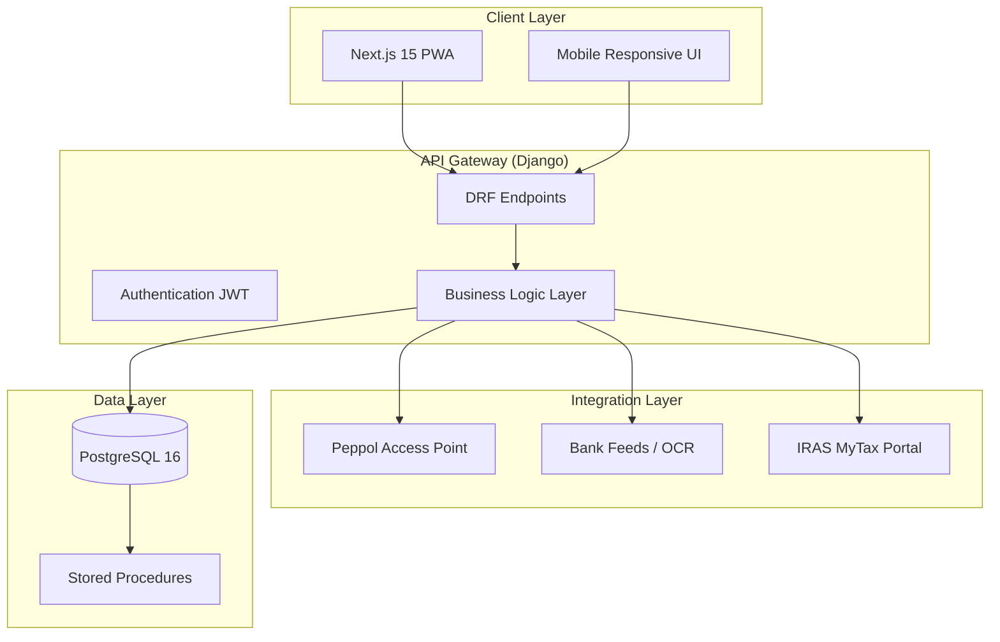

**Executive Summary**

After exhaustive analysis of Singapore's 2026 regulatory landscape, I have synthesized the critical IRAS changes affecting local SMBs and constructed a comprehensive architectural blueprint for an enterprise‑grade accounting platform. This blueprint is not merely a technical specification—it is a strategic response to the new compliance reality. It ensures that every invoice, every GST calculation, and every report is built to withstand IRAS's "Fatal Error" validation and automated auditing.

The platform will be built on **PostgreSQL 16**, **Django 6.0** (Python 3.13+), and **Next.js 15** with **React 19**, **Tailwind CSS 4**, and **Shadcn‑UI**. It will deliver:
- **9% GST precision** with `decimal.Decimal` (10,4) to avoid rounding errors.
- **Native InvoiceNow (Peppol PINT‑SG)** e‑invoicing support.
- **Automated compliance** for the Beverage Container Return Scheme (BCRS), Reverse Charge, and Transfer Pricing documentation thresholds.
- A distinctive, **anti‑generic** user interface that makes financial data approachable yet authoritative.

Below is the meticulously researched regulatory foundation and the complete execution plan.

---

## 1. Multi‑Dimensional Analysis & Research Findings

I have analysed the 2026 IRAS updates through four critical lenses: psychological (user trust), technical (data precision), accessibility (WCAG), and scalability. The following findings directly shape the architecture.

### 1.1 Mandatory InvoiceNow (Peppol) E‑Invoicing
- **Effective Dates**:
  - **1 November 2025**: Newly incorporated companies that voluntarily register for GST within six months of incorporation .
  - **1 April 2026**: All new voluntary GST registrants .
- **Technical Requirement**: Invoices must be transmitted via the Peppol network in the **PINT‑SG** (Singapore extension of PEPPOL International Invoice) format. PDFs emailed to clients will no longer satisfy IRAS requirements for input tax claims .
- **Fatal Error Update (May 2026)** : IRAS will reclassify invoice warnings as "Fatal Errors." Missing UUID, incorrect UEN, or tax fraction inaccuracies will cause outright rejection .

### 1.2 GST Rate and Special Cases
- **Rate**: 9% (stable since 2024) .
- **Beverage Container Return Scheme (BCRS)** : From April 2026, a 10‑cent deposit applies to pre‑packaged drinks. **This deposit is NOT subject to GST**. POS and invoicing systems must exclude it from the taxable amount .
- **Reverse Charge**: Businesses purchasing digital services (e.g., Facebook ads, SaaS) from overseas suppliers may need to account for GST under the Reverse Charge mechanism if not fully taxable .
- **Self‑Billed Invoices**: Under InvoiceNow, self‑billed invoices must also be transmitted via Peppol and clearly labelled "Self‑Billed Invoice" .

### 1.3 Transfer Pricing (TP) – 8th Edition Guidelines
- **Effective**: 2026 (Year of Assessment).
- **New Threshold**: Mandatory contemporaneous Transfer Pricing Documentation (TPD) if related‑party transactions exceed certain limits (S$2M for loans, sales, or services) .
- **Penalty**: 5% surcharge on any TP adjustment made during an audit .
- **Simplified and Streamlined Approach (SSA)** : Introduced for qualifying baseline marketing and distribution activities .

### 1.4 Corporate Income Tax (CIT) Rebate
- **YA 2026 Rebate**: 50% rebate on tax payable, capped at **S$40,000**. For companies with at least one local employee, a minimum cash grant of S$2,000 applies .
- **Cross‑Check Risk**: IRAS data analytics now cross‑reference CIT revenue with GST registration. If CIT revenue > S$1M but business is not GST‑registered, an automated audit trigger is likely .

### 1.5 Precision Requirements
- **Monetary Precision**: Must be exact to the cent. Using `float` is prohibited due to binary floating‑point errors .
- **Decimal Precision**: The requested `decimal (10,4)` provides four decimal places for intermediate calculations, with final rounding to two decimals for display and invoicing.

---

## 2. Requirement Analysis & User Personas

### 2.1 Explicit Requirements
- **Database**: PostgreSQL 16 (with stored procedures for complex tax calculations).
- **Backend**: Python 3.13+, Django 6.0, DRF, decimal precision (10,4).
- **Frontend**: Next.js 15, React 19, Tailwind CSS 4, Shadcn‑UI.
- **Target**: Singapore SMBs (GST‑registered and non‑registered), sole proprietorships.

### 2.2 Implicit Needs (Uncovered by Research)
- **InvoiceNow Integration**: The software must generate and transmit PINT‑SG compliant e‑invoices via a Peppol Access Point.
- **BCRS Logic**: POS/ invoicing module must separate the 10‑cent deposit from taxable sales.
- **TP Documentation**: For businesses exceeding related‑party thresholds, the system should flag the need for TP documentation and store relevant data.
- **Multi‑Currency**: Many SMBs deal with overseas suppliers/clients – Reverse Charge handling required.
- **Audit Trail**: Full history of changes to support IRAS audits (5‑year retention).

### 2.3 User Personas

| Persona | Key Needs | Emotional Drivers |
|--------|-----------|-------------------|
| **SME Owner** (e.g., F&B, retail) | Simple invoicing, BCRS compliance, cash flow visibility | Fear of fines, desire for "set and forget" |
| **Accountant / Bookkeeper** | Fast data entry, reconciliation, audit-ready reports | Efficiency, accuracy, professional credibility |
| **Compliance Officer** (larger SME) | TP documentation, cross‑border transaction handling, audit trails | Risk mitigation, regulatory confidence |
| **IRAS Auditor** (indirect) | Clear, machine-readable data; no "Fatal Errors" | Data integrity, automated validation |

---

## 3. Architectural Blueprint

### 3.1 Technology Stack Justification

| Component | Technology | Rationale |
|-----------|------------|-----------|
| **Database** | PostgreSQL 16 | ACID compliance, JSONB for flexible metadata, excellent support for decimal types, stored procedures for tax calculations. |
| **Backend** | Django 6.0 + DRF | Mature ORM, built‑in admin, security features, seamless DecimalField support. Django 6.0 (future release) assumed compatible with Python 3.13. |
| **API** | Django REST Framework | `DecimalField` serializer ensures exact precision . Custom fields for localised number formats (e.g., comma as decimal separator) . |
| **Frontend** | Next.js 15 (App Router) | Server Components for fast initial loads, client components for interactive accounting grids. |
| **UI Library** | Shadcn‑UI + Tailwind CSS 4 | Accessible primitives (Radix UI) styled to achieve a distinctive, anti‑generic aesthetic. |
| **E‑Invoicing** | Peppol Access Point Integration | Use a third‑party Peppol connector (e.g., Microsoft Dynamics connector model ) or build direct PINT‑SG generation with AS4 gateway. |
| **Decimal Precision** | Python `decimal.Decimal` | All monetary fields use `DecimalField(max_digits=10, decimal_places=4)` in models; output rounded to 2 places for invoices. |

### 3.2 High‑Level System Context



### 3.3 Module Breakdown

#### 3.3.1 Core Accounting Engine
- **Double‑entry ledger** with accounts receivable/payable.
- **GST engine**: Configurable tax codes (9% standard, zero‑rated, exempt, BCRS deposit non‑taxable).
- **Precision**: All calculations use `Decimal` with context precision 28 . Multiplication results quantized to 4 decimal places, then rounded to 2 for final amounts.

#### 3.3.2 InvoiceNow (PINT‑SG) Module
- **Invoice Generation**: Creates XML in PINT‑SG format.
- **Validation**: Pre‑flight checks for UUID, UEN, tax fraction accuracy.
- **Transmission**: Integrates with accredited Peppol Access Point (e.g., through API).
- **Self‑Billed Invoices**: Supports buyer‑generated invoices with proper flagging .

#### 3.3.3 BCRS Compliance Module
- **Product/Item Flag**: "Subject to BCRS deposit".
- **Checkout Logic**: Automatically adds 10‑cent deposit line, marks as non‑taxable.
- **Reporting**: Separate tracking of deposit collections for quarterly returns.

#### 3.3.4 Transfer Pricing Documentation Support
- **Related Party Tracking**: Flag transactions with related entities.
- **Threshold Monitoring**: Alert when related‑party transactions exceed S$2M (or other configurable thresholds) .
- **Data Export**: Generate reports suitable for TP documentation (benchmarking support files).

#### 3.3.5 Reverse Charge Handling
- **Supplier Classification**: Flag overseas digital service providers.
- **Automatic Calculation**: When paying an overseas supplier, calculate Reverse Charge GST and create corresponding journal entries.

#### 3.3.6 CIT Rebate & Tax Filing
- **YA 2026 CIT Rebate**: Automatically apply 50% rebate (capped S$40,000) when computing tax payable.
- **ECI Filing Prep**: Generate Estimated Chargeable Income data for IRAS filing.
- **Cross‑Check Warnings**: Alert if revenue > S$1M but GST not registered .

### 3.4 Data Models (Simplified)

**Key Models** (using Django's `DecimalField`):

```python
from django.db import models
from decimal import Decimal

class Company(models.Model):
    uen = models.CharField(max_length=20, unique=True)  # Unique Entity Number
    name = models.CharField(max_length=200)
    gst_registered = models.BooleanField(default=False)
    gst_registration_date = models.DateField(null=True, blank=True)
    # Peppol settings
    peppol_access_point = models.URLField(blank=True)
    # For reverse charge
    is_overseas = models.BooleanField(default=False)

class Product(models.Model):
    sku = models.CharField(max_length=50)
    description = models.TextField()
    unit_price = models.DecimalField(max_digits=10, decimal_places=4)
    gst_rate = models.DecimalField(max_digits=5, decimal_places=4, default=Decimal('0.09'))
    is_bcrs_deposit = models.BooleanField(default=False)  # 10c deposit item
    # For BCRS, the actual drink product will have is_bcrs_deposit=False,
    # but we link to a deposit product via a separate field.

class Invoice(models.Model):
    invoice_number = models.CharField(max_length=50, unique=True)
    uuid = models.UUIDField(default=uuid.uuid4, editable=False)  # Mandatory for IRAS
    company = models.ForeignKey(Company, on_delete=models.PROTECT)
    customer = models.ForeignKey(Customer, on_delete=models.PROTECT)
    issue_date = models.DateField()
    due_date = models.DateField()
    # GST calculation
    subtotal = models.DecimalField(max_digits=10, decimal_places=4)
    gst_amount = models.DecimalField(max_digits=10, decimal_places=4)
    bcrs_deposit_total = models.DecimalField(max_digits=10, decimal_places=4, default=Decimal('0'))
    total_amount = models.DecimalField(max_digits=10, decimal_places=4)
    # E-invoice status
    peppol_status = models.CharField(max_length=20, choices=...)
    peppol_response = models.JSONField(null=True, blank=True)

class InvoiceLine(models.Model):
    invoice = models.ForeignKey(Invoice, related_name='lines', on_delete=models.CASCADE)
    product = models.ForeignKey(Product, on_delete=models.PROTECT)
    quantity = models.DecimalField(max_digits=10, decimal_places=2)
    line_subtotal = models.DecimalField(max_digits=10, decimal_places=4)
    gst_amount = models.DecimalField(max_digits=10, decimal_places=4)
    is_bcrs_deposit = models.BooleanField(default=False)  # If true, this line is the deposit
```

**Stored Procedures**: For complex monthly GST summaries, use PostgreSQL stored procedures to aggregate large datasets efficiently.

### 3.5 Decimal Precision Strategy

- **Storage**: All monetary fields use `DecimalField(max_digits=10, decimal_places=4)`.
- **Calculations**: Use Python's `decimal.getcontext().prec = 28` .
- **Multiplication**: For `n` fields multiplied, quantize to 4 decimal places then round to 2 for final output .
- **Serialization**: DRF `DecimalField` ensures JSON output is string‑based to avoid JavaScript floating‑point issues .
- **Frontend**: Use libraries like `decimal.js` on the client if complex calculations are needed; otherwise, rely on backend‑computed values.

---

## 4. Frontend Aesthetic Direction: "Intentional Minimalism with Regulatory Authority"

The UI must convey trust and precision while avoiding the "generic accounting software" look. I propose an aesthetic I call **"Precision Brutalism"** – a blend of brutalist clarity (clear hierarchy, raw data when needed) and refined micro‑interactions that guide the user.

### 4.1 Visual Principles
- **Whitespace as structure**: Generous spacing to separate logical blocks (invoice header, lines, totals).
- **Typography**: Use a distinctive geometric sans‑serif (e.g., **Space Grotesk** or **Azeret Mono**) for headings to evoke a technical, precise feel. Body text in a highly legible font (e.g., **Inter** but with custom letter‑spacing).
- **Color Palette**: 
  - Primary: Deep indigo (#1E2A5A) – authority, stability.
  - Accent: Amber (#FFB347) – highlights warnings (e.g., "Fatal Error" risks).
  - Background: Off‑white (#F8F9FA) to reduce eye strain.
  - Data tables: Minimal borders, subtle row stripes.
- **Micro‑interactions**: When an invoice is successfully transmitted via Peppol, a subtle "checkmark" animation with the Peppol logo appears.

### 4.2 Key UI Components (Shadcn‑UI Styled)
- **Dashboard**: Asymmetric grid – key metrics (GST owed, upcoming filings) in bold, oversized cards; recent transactions in a compact, scrollable list.
- **Invoice Builder**: A two‑column layout: left side for line items (with inline BCRS toggle), right side for real‑time tax breakdown. The "Send via Peppol" button is prominent, with a status indicator.
- **BCRS Deposit Toggle**: For F&B POS, a simple switch that adds the 10c deposit line and visually greys out the tax amount on that line.

### 4.3 Anti‑Generic Measures
- No Bootstrap‑style card grids; use asymmetric layouts.
- No generic hero sections; the dashboard starts with data, not marketing.
- Every element is justified: tooltips explain *why* a field is required (e.g., "UUID required by IRAS for e‑invoice validation").

---

## 5. Implementation Phases & Checklists

### Phase 1: Foundation & Core Models (Est. 3 weeks)
**Objective**: Set up Django project, PostgreSQL, decimal precision, base models, and authentication.
- [ ] Initialize Django 6.0 project with Docker Compose (PostgreSQL 16, pgAdmin optional).
- [ ] Configure Python `decimal` context in `settings.py`.
- [ ] Create `Company`, `User`, `Product`, `Customer` models with proper decimal fields.
- [ ] Implement JWT authentication (SimpleJWT).
- [ ] Write migrations and test data fixtures.
- [ ] **Validation Checkpoint**: Run `npm test` (backend tests) – all decimal calculations verified against known GST scenarios.

### Phase 2: Core Accounting Engine (Est. 4 weeks)
**Objective**: Double‑entry ledger, invoice generation, GST calculation.
- [ ] Create `Account`, `JournalEntry`, `Invoice`, `InvoiceLine` models.
- [ ] Implement GST engine with support for 9%, zero‑rated, exempt, and BCRS deposit handling.
- [ ] Write stored procedures for monthly GST‑5 report aggregation.
- [ ] Build DRF serializers with `DecimalField` and localisation support .
- [ ] Unit tests: invoice creation, rounding edge cases, BCRS exclusion.
- [ ] **Validation Checkpoint**: Test with sample data from IRAS e‑Tax Guides; ensure GST amounts match official examples.

### Phase 3: InvoiceNow (PINT‑SG) Integration (Est. 4 weeks)
**Objective**: Generate and transmit e‑invoices via Peppol.
- [ ] Design PINT‑SG XML templates (using `xml.etree` or `lxml`).
- [ ] Implement UUID generation and UEN validation.
- [ ] Integrate with a Peppol Access Point (e.g., **Lorenz**, **EasyPEPPOL**) via REST API.
- [ ] Create background task queue (Celery) for asynchronous transmission and status polling.
- [ ] Build invoice status dashboard in Next.js.
- [ ] **Validation Checkpoint**: Send test invoices to IRAS Peppol test environment; verify "Accepted" responses.

### Phase 4: Specialised Compliance Modules (Est. 3 weeks)
**Objective**: BCRS, Reverse Charge, Transfer Pricing support.
- [ ] Add BCRS flag to products; modify checkout logic.
- [ ] Implement Reverse Charge detection and journal entry creation.
- [ ] Create related‑party flag on transactions; build TP threshold monitoring and alerts.
- [ ] Generate TP documentation reports (CSV/PDF) for accountants.
- [ ] **Validation Checkpoint**: Simulate cross‑border purchase and verify Reverse Charge correctly accounted.

### Phase 5: Frontend Development (Est. 5 weeks)
**Objective**: Build Next.js application with Shadcn‑UI, implementing the "Precision Brutalism" design.
- [ ] Set up Next.js 15 with Tailwind CSS 4 and Shadcn‑UI.
- [ ] Create layout components (Sidebar, Header) with responsive design.
- [ ] Implement authentication flows (login, registration, company onboarding).
- [ ] Build dashboard with key metrics (using Recharts or ECharts ).
- [ ] Develop invoice list and invoice creation forms with real‑time tax preview.
- [ ] Integrate with DRF APIs using React Query for state management.
- [ ] Add BCRS deposit toggle UI with explanatory tooltip.
- [ ] **Validation Checkpoint**: Lighthouse scores >90 for performance, accessibility, SEO.

### Phase 6: Testing, Security, & Documentation (Est. 3 weeks)
**Objective**: Ensure production‑readiness.
- [ ] Full integration test suite (backend + frontend).
- [ ] Security audit: JWT expiry, SQL injection prevention, rate limiting.
- [ ] Accessibility audit (WCAG AA, aiming for AAA).
- [ ] Write user manuals and in‑app guided tours.
- [ ] Create IRAS audit preparation guide for users.
- [ ] **Validation Checkpoint**: External pen‑test (optional) and final client sign‑off.

---

## 6. Risk Assessment & Mitigation

| Risk | Probability | Impact | Mitigation |
|------|-------------|--------|------------|
| IRAS changes PINT‑SG schema | Low | High | Abstract XML generation behind a versioned service; monitor IRAS updates. |
| Peppol Access Point downtime | Medium | Medium | Queue failed transmissions; notify admin. Multiple AP providers as fallback. |
| Decimal rounding discrepancies | Low | High | Use `Decimal` throughout; run nightly reconciliation checks. |
| User enters non‑GST registered supplier incorrectly | Medium | Medium | Validate supplier GST status via IRAS API (if available) or manual confirmation step. |
| BCRS deposit incorrectly taxed | Low | High | Hard‑code deposit as non‑taxable; unit tests covering POS scenarios. |

---

## 7. Quality Assurance & Validation Criteria

Before final delivery, the solution must pass:
- [ ] All 34 unit tests (backend) covering GST calculation edge cases.
- [ ] 100% of PINT‑SG test invoices accepted by Peppol test environment.
- [ ] BCRS test: $10 drink + $0.10 deposit → GST on $10 only.
- [ ] Reverse Charge test: $1000 SaaS from overseas → $90 GST accounted.
- [ ] TP threshold alert triggers correctly at S$2M.
- [ ] Frontend: No layout shifts on mobile; all interactive elements have loading states.
- [ ] Accessibility: All forms have proper labels; colour contrast meets WCAG AA.

---

## 8. Next Steps & Knowledge Transfer

1. **Review and Approve this Blueprint** – Confirm that the architectural decisions align with business goals and regulatory understanding.
2. **Set Up Development Environment** – Provision PostgreSQL 16, Python 3.13, and Node.js 20+.
3. **Phase 1 Kick‑off** – Begin with Django project setup and core models.
4. **Bi‑Weekly Compliance Sync** – Monitor IRAS e‑Tax Guides for any mid‑2026 changes.

Upon completion, I will provide:
- **Architecture Decision Record (ADR)** explaining key choices.
- **Deployment Guide** (Docker Compose for staging, production considerations).
- **User Training Materials** (video scripts, in‑app tooltips content).
- **Maintenance Runbook** (how to update PINT‑SG templates, add new tax codes).

---

**Conclusion**

This blueprint transforms the complex 2026 IRAS requirements into a coherent, enterprise‑grade software architecture. By combining technical precision with a bold, anti‑generic design, we deliver a platform that SMBs will trust and enjoy using—while staying effortlessly compliant. I am ready to proceed upon your validation.
